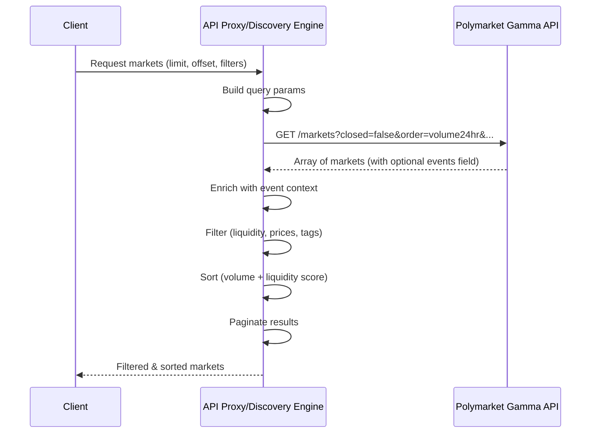

# Design Document: Direct Market Discovery

## Overview

This design refactors the market discovery system to fetch markets directly from the Polymarket `/markets` API endpoint instead of the current approach of fetching events and extracting markets from nested structures. The change simplifies the codebase, reduces processing overhead, and maintains all existing functionality including filtering, sorting, and event context enrichment.

### Key Changes

1. **Backend**: Replace `fetchTrendingMarketsFromEvents()` with direct `/markets` endpoint calls
2. **Frontend**: Update API proxy to fetch from `/markets` instead of `/events`
3. **Event Context**: Enrich markets with event metadata when available in the response
4. **Compatibility**: Maintain all existing filtering, sorting, and validation logic

### Benefits

- Simpler code without nested event/market loops
- Fewer API calls and reduced processing time
- More direct mapping between API response and application data
- Easier to maintain and extend

## Architecture

### Current Architecture (Event-Based)

```
┌─────────────┐
│   Client    │
└──────┬──────┘
       │
       ▼
┌─────────────────────────────┐
│  API Proxy / Discovery Eng  │
└──────┬──────────────────────┘
       │
       ▼
┌─────────────────────────────┐
│  GET /events?order=volume   │
│  (Polymarket Gamma API)     │
└──────┬──────────────────────┘
       │
       ▼
┌─────────────────────────────┐
│  Process Events Array       │
│  ├─ Filter active events    │
│  ├─ Extract markets array   │
│  └─ Enrich with event data  │
└──────┬──────────────────────┘
       │
       ▼
┌─────────────────────────────┐
│  Filter & Sort Markets      │
└──────┬──────────────────────┘
       │
       ▼
┌─────────────────────────────┐
│  Return to Client           │
└─────────────────────────────┘
```

### New Architecture (Direct Market)

```
┌─────────────┐
│   Client    │
└──────┬──────┘
       │
       ▼
┌─────────────────────────────┐
│  API Proxy / Discovery Eng  │
└──────┬──────────────────────┘
       │
       ▼
┌─────────────────────────────┐
│  GET /markets?order=volume  │
│  (Polymarket Gamma API)     │
└──────┬──────────────────────┘
       │
       ▼
┌─────────────────────────────┐
│  Process Markets Array      │
│  └─ Enrich with event data  │
│     (if events field exists)│
└──────┬──────────────────────┘
       │
       ▼
┌─────────────────────────────┐
│  Filter & Sort Markets      │
└──────┬──────────────────────┘
       │
       ▼
┌─────────────────────────────┐
│  Return to Client           │
└─────────────────────────────┘
```

### Component Interaction



## Components and Interfaces

### Backend: Market Discovery Engine

**File**: `tradewizard-agents/src/utils/market-discovery.ts`

**Modified Methods**:

```typescript
class PolymarketDiscoveryEngine {
  /**
   * Fetch trending markets directly from /markets endpoint
   * Replaces: fetchTrendingMarketsFromEvents()
   */
  private async fetchTrendingMarketsDirectly(limit: number = 100): Promise<PolymarketMarket[]> {
    // Implementation details below
  }

  /**
   * Enrich market with event context if available
   */
  private enrichMarketWithEventContext(market: any): PolymarketMarket {
    // Extract event metadata from market.events[0] if present
  }
}
```

**Implementation Details**:

```typescript
private async fetchTrendingMarketsDirectly(limit: number = 100): Promise<PolymarketMarket[]> {
  const maxRetries = 3;
  let lastError: Error | null = null;

  const MIN_LIQUIDITY_USD = 1000;
  const MIN_LIQUIDITY_NON_EVERGREEN_USD = 5000;
  const EVERGREEN_TAG_IDS = [2, 21, 120, 596, 1401, 100265, 100639];

  for (let attempt = 0; attempt <= maxRetries; attempt++) {
    try {
      // Fetch more than requested to account for filtering
      const fetchLimit = Math.max(limit * 3, 100);
      
      // Build URL with direct /markets endpoint
      let url = `${this.config.gammaApiUrl}/markets?closed=false&order=volume24hr&ascending=false&limit=${fetchLimit}&offset=0`;
      url += `&tag_id=${this.config.politicsTagId}`;

      const response = await fetch(url, {
        method: 'GET',
        headers: { 'Content-Type': 'application/json' },
        signal: AbortSignal.timeout(15000),
      });

      if (!response.ok) {
        throw new Error(`HTTP ${response.status}: ${response.statusText}`);
      }

      const markets = await response.json();

      if (!Array.isArray(markets)) {
        throw new Error('Invalid API response: expected array of markets');
      }

      // Enrich markets with event context
      const enrichedMarkets = markets.map(market => this.enrichMarketWithEventContext(market));

      // Apply filtering logic
      const validMarkets = enrichedMarkets.filter((market: PolymarketMarket) => {
        if (market.acceptingOrders === false) return false;
        if (market.closed === true) return false;
        if (!market.clobTokenIds) return false;

        // Check tradeable prices
        if (market.outcomePrices || market.outcome_prices) {
          try {
            const pricesStr = market.outcomePrices || market.outcome_prices;
            const prices = typeof pricesStr === 'string' ? JSON.parse(pricesStr) : pricesStr;
            const hasTradeablePrice = prices.some((price: string) => {
              const priceNum = parseFloat(price);
              return priceNum >= 0.05 && priceNum <= 0.95;
            });
            if (!hasTradeablePrice) return false;
          } catch {
            return false;
          }
        }

        // Apply liquidity filtering
        const marketTagIds = market.tags?.map((t: any) => parseInt(t.id)) || [];
        const hasEvergreenTag = EVERGREEN_TAG_IDS.some((id) => marketTagIds.includes(id));
        const liquidity = parseFloat(market.liquidity || '0');

        if (!hasEvergreenTag && liquidity < MIN_LIQUIDITY_NON_EVERGREEN_USD) {
          return false;
        }
        if (liquidity < MIN_LIQUIDITY_USD) return false;

        return true;
      });

      // Sort by combined liquidity + volume score
      const sortedMarkets = validMarkets.sort((a: PolymarketMarket, b: PolymarketMarket) => {
        const aScore = parseFloat(a.liquidity || '0') + 
                      parseFloat(a.volume24hr?.toString() || a.volume_24h?.toString() || a.volume || '0');
        const bScore = parseFloat(b.liquidity || '0') + 
                      parseFloat(b.volume24hr?.toString() || b.volume_24h?.toString() || b.volume || '0');
        return bScore - aScore;
      });

      logger.info({
        marketsReceived: markets.length,
        validMarkets: validMarkets.length,
        finalSorted: sortedMarkets.length,
      }, '[PolymarketDiscoveryEngine] Markets fetched directly from /markets API');

      return sortedMarkets;
    } catch (error) {
      lastError = error instanceof Error ? error : new Error('Unknown error');

      // Don't retry on 404 or 400 errors
      if (lastError.message.includes('404') || lastError.message.includes('400')) {
        throw lastError;
      }

      if (attempt === maxRetries) {
        throw lastError;
      }

      // Exponential backoff with jitter
      const baseDelay = Math.pow(2, attempt) * 1000;
      const jitter = Math.random() * 1000;
      await new Promise((resolve) => setTimeout(resolve, baseDelay + jitter));
    }
  }

  throw lastError || new Error('Max retries exceeded');
}

private enrichMarketWithEventContext(market: any): PolymarketMarket {
  // Check if market has events array
  if (market.events && Array.isArray(market.events) && market.events.length > 0) {
    const event = market.events[0];
    
    return {
      ...market,
      eventTitle: event.title,
      eventSlug: event.slug,
      eventId: event.id,
      eventIcon: event.image || event.icon,
      conditionId: market.conditionId || market.id,
      condition_id: market.conditionId || market.id,
      slug: market.slug,
      market_slug: market.slug,
      volume24hr: market.volume24hr,
      volume_24h: market.volume24hr,
      liquidity: market.liquidity || '0',
      active: market.active !== false,
      closed: market.closed === true,
      endDate: market.endDate,
      end_date_iso: market.endDate,
      createdAt: market.createdAt,
      created_at: market.createdAt,
      outcomes: market.outcomes,
      outcomePrices: market.outcomePrices,
      outcome_prices: market.outcomePrices,
    };
  }

  // No event context available
  return {
    ...market,
    conditionId: market.conditionId || market.id,
    condition_id: market.conditionId || market.id,
    slug: market.slug,
    market_slug: market.slug,
    volume24hr: market.volume24hr,
    volume_24h: market.volume24hr,
    liquidity: market.liquidity || '0',
    active: market.active !== false,
    closed: market.closed === true,
    endDate: market.endDate,
    end_date_iso: market.endDate,
    createdAt: market.createdAt,
    created_at: market.createdAt,
    outcomes: market.outcomes,
    outcomePrices: market.outcomePrices,
    outcome_prices: market.outcomePrices,
  };
}
```

### Frontend: API Proxy

**File**: `tradewizard-frontend/app/api/polymarket/markets/route.ts`

**Modified GET Handler**:

```typescript
export async function GET(request: NextRequest) {
  const searchParams = request.nextUrl.searchParams;
  const limit = searchParams.get("limit") || "20";
  const offset = searchParams.get("offset") || "0";
  const tagId = searchParams.get("tag_id");
  const includeClosed = searchParams.get("include_closed") === "true";
  const order = searchParams.get("order") || "volume24hr";

  try {
    const requestedLimit = parseInt(limit);
    const requestedOffset = parseInt(offset);
    
    // Fetch more than requested to account for filtering
    const fetchLimit = Math.max(requestedLimit * 3, 100);
    const fetchOffset = Math.floor(requestedOffset * 1.5);

    // Build URL for direct /markets endpoint
    let url = `${GAMMA_API_URL}/markets?closed=${includeClosed ? 'true' : 'false'}&order=${order}&ascending=false&limit=${fetchLimit}&offset=${fetchOffset}`;

    if (tagId) {
      url += `&tag_id=${tagId}`;
    }

    const response = await fetch(url, {
      headers: { "Content-Type": "application/json" },
      next: { revalidate: 60 },
    });

    if (!response.ok) {
      console.error("Gamma API error:", response.status);
      throw new Error(`Gamma API error: ${response.status}`);
    }

    const markets = await response.json();

    if (!Array.isArray(markets)) {
      console.error("Invalid response structure:", markets);
      return NextResponse.json(
        { error: "Invalid API response" },
        { status: 500 }
      );
    }

    // Enrich markets with event context
    const enrichedMarkets = markets.map((market: any) => {
      if (market.events && Array.isArray(market.events) && market.events.length > 0) {
        const event = market.events[0];
        return {
          ...market,
          eventTitle: event.title,
          eventSlug: event.slug,
          eventId: event.id,
          eventIcon: event.image || event.icon,
          negRisk: event.negRisk || false,
        };
      }
      return market;
    });

    // Apply filtering logic (same as before)
    const validMarkets = enrichedMarkets.filter((market: any) => {
      if (!market.clobTokenIds) return false;

      if (market.closed === true) {
        if (!includeClosed) return false;
        return true;
      }

      if (market.acceptingOrders === false) return false;

      if (market.outcomePrices) {
        try {
          const prices = JSON.parse(market.outcomePrices);
          const hasTradeablePrice = prices.some((price: string) => {
            const priceNum = parseFloat(price);
            return priceNum >= 0.05 && priceNum <= 0.95;
          });
          if (!hasTradeablePrice) return false;
        } catch {
          return false;
        }
      }

      const marketTagIds = market.tags?.map((t: any) => parseInt(t.id)) || [];
      const hasEvergreenTag = EVERGREEN_TAG_IDS.some((id) => marketTagIds.includes(id));
      const liquidity = parseFloat(market.liquidity || "0");

      if (!hasEvergreenTag && liquidity < MIN_LIQUIDITY_NON_EVERGREEN_USD) {
        return false;
      }
      if (liquidity < MIN_LIQUIDITY_USD) return false;

      return true;
    });

    // Apply sorting logic (same as before)
    const sortedMarkets = validMarkets.sort((a: any, b: any) => {
      if (a.closed && b.closed) {
        const aEndDate = new Date(a.endDateIso || a.endDate || 0).getTime();
        const bEndDate = new Date(b.endDateIso || b.endDate || 0).getTime();
        if (aEndDate !== bEndDate) {
          return bEndDate - aEndDate;
        }
        const aVolume = parseFloat(a.volume24hr || a.volume || "0");
        const bVolume = parseFloat(b.volume24hr || b.volume || "0");
        return bVolume - aVolume;
      }

      if (a.closed && !b.closed) return 1;
      if (!a.closed && b.closed) return -1;

      const aScore = parseFloat(a.liquidity || "0") + parseFloat(a.volume24hr || a.volume || "0");
      const bScore = parseFloat(b.liquidity || "0") + parseFloat(b.volume24hr || b.volume || "0");
      return bScore - aScore;
    });

    // Apply client-side pagination
    const startIndex = requestedOffset;
    const endIndex = startIndex + requestedLimit;
    const paginatedMarkets = sortedMarkets.slice(startIndex, endIndex);

    return NextResponse.json(paginatedMarkets);
  } catch (error) {
    console.error("Error fetching markets:", error);
    return NextResponse.json(
      { error: error instanceof Error ? error.message : "Failed to fetch markets" },
      { status: 500 }
    );
  }
}
```

### Frontend: Market Search Utility

**File**: `tradewizard-frontend/lib/market-search.ts`

**Changes**: The `findMarketBySlug()` function already uses the `/markets` endpoint for direct lookups, so minimal changes are needed. The event-based fallback search can remain as a secondary option for backward compatibility.

### Frontend: useMarkets Hook

**File**: `tradewizard-frontend/hooks/useMarkets.ts`

**Changes**: No changes required. The hook already calls the API proxy, which will now use the direct `/markets` endpoint internally.

## Data Models

### PolymarketMarket Interface

The existing `PolymarketMarket` interface remains unchanged:

```typescript
interface PolymarketMarket {
  id: string;
  question: string;
  description?: string;
  slug: string;
  active: boolean;
  closed: boolean;
  icon?: string;
  image?: string;
  volume?: string;
  volume24hr?: string | number;
  liquidity?: string | number;
  spread?: string;
  outcomes?: string;
  outcomePrices?: string;
  clobTokenIds?: string;
  conditionId?: string;
  endDate?: string;
  endDateIso?: string;
  gameStartTime?: string;
  events?: any[];
  
  // Event context (enriched)
  eventTitle?: string;
  eventSlug?: string;
  eventId?: string;
  eventIcon?: string;
  negRisk?: boolean;
  
  // Backend-specific fields
  condition_id?: string;
  market_slug?: string;
  volume_24h?: string | number;
  outcome_prices?: string;
  end_date_iso?: string;
  created_at?: string;
  createdAt?: string;
  
  [key: string]: any;
}
```

### API Query Parameters

**Direct Markets Endpoint**:

```typescript
interface MarketsQueryParams {
  closed: boolean;           // Filter by market status
  order: string;            // Sort field (volume24hr, liquidity, etc.)
  ascending: boolean;       // Sort direction
  tag_id?: number;          // Filter by tag (e.g., 2 for politics)
  limit: number;            // Number of results
  offset: number;           // Pagination offset
}
```

**Example URLs**:

```
# Trending markets (volume-based)
GET /markets?closed=false&order=volume24hr&ascending=false&tag_id=2&limit=100&offset=0

# All markets (liquidity-based)
GET /markets?closed=false&order=liquidity&ascending=false&tag_id=2&limit=100&offset=0

# Closed markets
GET /markets?closed=true&order=volume24hr&ascending=false&tag_id=2&limit=100&offset=0
```

## Correctness Properties


A property is a characteristic or behavior that should hold true across all valid executions of a system—essentially, a formal statement about what the system should do. Properties serve as the bridge between human-readable specifications and machine-verifiable correctness guarantees.

### Property 1: URL Construction with Required Parameters

*For any* valid set of query parameters (closed, order, ascending, tag_id, limit, offset), constructing an API URL should include all specified parameters in the query string.

**Validates: Requirements 1.2, 2.2**

### Property 2: Event Context Enrichment

*For any* market with a non-empty `events` array, enriching the market should populate `eventTitle`, `eventSlug`, `eventId`, and `eventIcon` fields with values from the first event in the array.

**Validates: Requirements 3.1, 3.2**

### Property 3: Missing Event Context Handling

*For any* market without an `events` array or with an empty `events` array, enriching the market should leave event context fields (`eventTitle`, `eventSlug`, `eventId`, `eventIcon`) undefined or null.

**Validates: Requirements 1.4, 3.3**

### Property 4: Market Status Parameter Mapping

*For any* market status value ("active", "closed", "all"), the system should map it to the correct `closed` parameter value in the API URL (false for "active", true for "closed" or "all").

**Validates: Requirements 2.3, 4.4, 4.5**

### Property 5: Category Tag Parameter Mapping

*For any* valid category with an associated tag ID, requesting markets for that category should include the correct `tag_id` parameter in the API URL.

**Validates: Requirements 4.3**

### Property 6: Filtering Consistency

*For any* set of markets, applying the filtering logic (acceptingOrders, clobTokenIds, tradeable prices, liquidity thresholds, evergreen tags) should produce the same results regardless of whether markets came from the `/events` or `/markets` endpoint.

**Validates: Requirements 1.5, 2.5, 9.4**

### Property 7: AcceptingOrders Filtering

*For any* market where `acceptingOrders` is false, the filtering logic should exclude that market from the results.

**Validates: Requirements 5.1**

### Property 8: ClobTokenIds Requirement

*For any* market without a `clobTokenIds` field, the filtering logic should exclude that market from the results.

**Validates: Requirements 5.2**

### Property 9: Tradeable Price Validation

*For any* market with an `outcomePrices` field, the filtering logic should only include the market if at least one price is between 0.05 and 0.95 (inclusive).

**Validates: Requirements 5.3**

### Property 10: Liquidity Threshold Filtering

*For any* market, the filtering logic should apply a $1,000 minimum liquidity threshold for markets with evergreen tags, and a $5,000 minimum for markets without evergreen tags.

**Validates: Requirements 5.4, 5.5**

### Property 11: Open Market Sorting

*For any* set of open markets, sorting should order them by descending combined score (liquidity + volume24hr), such that markets with higher scores appear first.

**Validates: Requirements 6.1**

### Property 12: Closed Market Sorting

*For any* set of closed markets, sorting should order them by end date (most recent first), with volume as a tiebreaker for markets with the same end date.

**Validates: Requirements 6.2**

### Property 13: Mixed Market Sorting Precedence

*For any* set containing both open and closed markets, sorting should place all open markets before all closed markets.

**Validates: Requirements 6.3**

### Property 14: HTTP Error Handling

*For any* API response with a non-200 status code, the system should throw an error that includes the status code in the error message.

**Validates: Requirements 7.1**

### Property 15: Invalid Response Structure Handling

*For any* API response that is not a valid array, the system should throw an error indicating invalid response structure.

**Validates: Requirements 7.2**

### Property 16: JSON Parsing Error Recovery

*For any* market with invalid JSON in the `outcomePrices` field, the filtering logic should skip that market and continue processing remaining markets without throwing an error.

**Validates: Requirements 7.3**

### Property 17: Retry Logic for Transient Failures

*For any* transient API failure (network timeout, 5xx error), the backend should retry the request with exponential backoff, up to a maximum of 3 retries.

**Validates: Requirements 7.4**

### Property 18: No Retry for Client Errors

*For any* API response with a 400 or 404 status code, the backend should not retry the request and should immediately throw the error.

**Validates: Requirements 7.5**

### Property 19: Pagination Parameter Forwarding

*For any* frontend request with `limit` and `offset` parameters, the API proxy should include these parameters (with appropriate multipliers for over-fetching) in the Gamma API request.

**Validates: Requirements 8.1**

### Property 20: Pagination Termination Detection

*For any* API response with fewer markets than the requested limit, the frontend should recognize this as the end of available data and not request additional pages.

**Validates: Requirements 8.2**

### Property 21: Offset Increment for Infinite Scroll

*For any* sequence of pagination requests, the offset should increment by the page size for each subsequent request (offset_n = offset_0 + n * pageSize).

**Validates: Requirements 8.3**

### Property 22: Over-Fetching Strategy

*For any* requested limit value, the API proxy should fetch at least 3x that limit from the Gamma API to account for filtering, then apply client-side pagination to return the requested number of results.

**Validates: Requirements 8.4**

### Property 23: Data Structure Backward Compatibility

*For any* market returned by the new implementation, the data structure should contain all the same fields as the old implementation, including `volume24hr`, `liquidity`, `outcomePrices`, `clobTokenIds`, and event context fields when available.

**Validates: Requirements 9.1, 9.2, 9.3**

### Property 24: Sorting Behavior Consistency

*For any* category (trending, all), the sorting behavior should match the previous implementation (volume-based for trending, liquidity-based for all).

**Validates: Requirements 9.5**

## Error Handling

### Backend Error Handling

**API Request Errors**:
- HTTP errors (4xx, 5xx): Throw descriptive errors with status codes
- Network timeouts: Retry with exponential backoff (max 3 attempts)
- Invalid response structure: Throw error immediately without retry
- Client errors (400, 404): No retry, immediate error propagation

**Data Processing Errors**:
- Invalid JSON in market fields: Skip the market, log warning, continue processing
- Missing required fields: Filter out the market during validation
- Type conversion errors: Use default values (0 for numbers, empty string for strings)

**Retry Strategy**:
```typescript
// Exponential backoff with jitter
const baseDelay = Math.pow(2, attempt) * 1000; // 1s, 2s, 4s
const jitter = Math.random() * 1000; // 0-1s random jitter
const delay = baseDelay + jitter;
```

### Frontend Error Handling

**API Proxy Errors**:
- Gamma API errors: Return 500 with error message
- Invalid response structure: Return 500 with descriptive error
- Network errors: Let Next.js handle with automatic retry

**Client-Side Errors**:
- React Query handles retries automatically (3 attempts by default)
- Display error states in UI with retry buttons
- Gracefully degrade when markets fail to load

**Logging**:
- Backend: Use structured logging with context (market count, filter results, timing)
- Frontend: Console errors for debugging, avoid exposing to users

## Testing Strategy

### Dual Testing Approach

This feature requires both unit tests and property-based tests to ensure comprehensive coverage:

- **Unit tests**: Verify specific examples, edge cases, and error conditions
- **Property tests**: Verify universal properties across all inputs
- Both are complementary and necessary for comprehensive coverage

### Unit Testing

Unit tests should focus on:

1. **Specific Examples**:
   - Fetching markets with specific query parameters
   - Enriching a market with known event data
   - Filtering a market with specific liquidity values
   - Sorting a known set of markets

2. **Edge Cases**:
   - Empty markets array from API
   - Market with missing optional fields
   - Market with malformed JSON in outcomePrices
   - API returning exactly the requested limit (pagination boundary)

3. **Error Conditions**:
   - API returning 404 error
   - API returning 500 error
   - Network timeout
   - Invalid response structure (object instead of array)

4. **Integration Points**:
   - Backend method calling the correct API endpoint
   - Frontend API proxy forwarding parameters correctly
   - Event context enrichment with real market data

### Property-Based Testing

Property tests should use **fast-check** (TypeScript) and run a minimum of 100 iterations per test.

Each property test must include a comment tag referencing the design document:

```typescript
// Feature: direct-market-discovery, Property 1: URL Construction with Required Parameters
```

**Property Test Examples**:

```typescript
import fc from 'fast-check';

// Feature: direct-market-discovery, Property 2: Event Context Enrichment
test('markets with events array should be enriched with event metadata', () => {
  fc.assert(
    fc.property(
      fc.record({
        id: fc.string(),
        question: fc.string(),
        events: fc.array(fc.record({
          title: fc.string(),
          slug: fc.string(),
          id: fc.string(),
          image: fc.option(fc.string()),
          icon: fc.option(fc.string()),
        }), { minLength: 1 }),
      }),
      (market) => {
        const enriched = enrichMarketWithEventContext(market);
        const firstEvent = market.events[0];
        
        expect(enriched.eventTitle).toBe(firstEvent.title);
        expect(enriched.eventSlug).toBe(firstEvent.slug);
        expect(enriched.eventId).toBe(firstEvent.id);
        expect(enriched.eventIcon).toBe(firstEvent.image || firstEvent.icon);
      }
    ),
    { numRuns: 100 }
  );
});

// Feature: direct-market-discovery, Property 9: Tradeable Price Validation
test('markets should only pass filtering if at least one price is between 0.05 and 0.95', () => {
  fc.assert(
    fc.property(
      fc.record({
        acceptingOrders: fc.constant(true),
        closed: fc.constant(false),
        clobTokenIds: fc.constant('["token1"]'),
        outcomePrices: fc.array(fc.float({ min: 0, max: 1 })).map(prices => JSON.stringify(prices)),
        liquidity: fc.constant('10000'),
        tags: fc.constant([]),
      }),
      (market) => {
        const prices = JSON.parse(market.outcomePrices);
        const hasTradeablePrice = prices.some((p: number) => p >= 0.05 && p <= 0.95);
        const passesFilter = filterMarket(market);
        
        expect(passesFilter).toBe(hasTradeablePrice);
      }
    ),
    { numRuns: 100 }
  );
});

// Feature: direct-market-discovery, Property 11: Open Market Sorting
test('open markets should be sorted by descending combined score', () => {
  fc.assert(
    fc.property(
      fc.array(
        fc.record({
          closed: fc.constant(false),
          liquidity: fc.float({ min: 0, max: 100000 }).map(String),
          volume24hr: fc.float({ min: 0, max: 100000 }),
        }),
        { minLength: 2, maxLength: 20 }
      ),
      (markets) => {
        const sorted = sortMarkets(markets);
        
        for (let i = 0; i < sorted.length - 1; i++) {
          const scoreA = parseFloat(sorted[i].liquidity) + parseFloat(sorted[i].volume24hr);
          const scoreB = parseFloat(sorted[i + 1].liquidity) + parseFloat(sorted[i + 1].volume24hr);
          expect(scoreA).toBeGreaterThanOrEqual(scoreB);
        }
      }
    ),
    { numRuns: 100 }
  );
});
```

### Test Organization

**Backend Tests**:
- `tradewizard-agents/src/utils/market-discovery.test.ts` - Unit tests
- `tradewizard-agents/src/utils/market-discovery.property.test.ts` - Property tests

**Frontend Tests**:
- `tradewizard-frontend/app/api/polymarket/markets/route.test.ts` - API proxy unit tests
- `tradewizard-frontend/app/api/polymarket/markets/route.property.test.ts` - API proxy property tests
- `tradewizard-frontend/lib/market-search.test.ts` - Market search utility tests

### Test Coverage Goals

- Line coverage: >80%
- Branch coverage: >75%
- Property tests: All 24 properties implemented
- Unit tests: All edge cases and error conditions covered

### Testing Commands

```bash
# Backend
cd tradewizard-agents
npm test                    # Run all tests
npm run test:watch          # Watch mode
npm run test:coverage       # Generate coverage report

# Frontend
cd tradewizard-frontend
npm test                    # Run all tests
npm run test:watch          # Watch mode
```

## Migration Strategy

### Phase 1: Backend Implementation

1. Implement `fetchTrendingMarketsDirectly()` method
2. Implement `enrichMarketWithEventContext()` helper
3. Add feature flag to switch between old and new implementation
4. Write unit tests and property tests
5. Test with real Polymarket API in development

### Phase 2: Backend Validation

1. Run both implementations in parallel (feature flag)
2. Compare results for consistency
3. Monitor error rates and performance metrics
4. Validate filtering and sorting produce same results

### Phase 3: Frontend Implementation

1. Update API proxy to use `/markets` endpoint
2. Maintain event enrichment logic
3. Add feature flag for gradual rollout
4. Write tests for API proxy

### Phase 4: Frontend Validation

1. Test with real user traffic (A/B test)
2. Monitor page load times and API response times
3. Validate UI displays markets correctly
4. Check for any missing event context issues

### Phase 5: Cleanup

1. Remove old event-based implementation
2. Remove feature flags
3. Update documentation
4. Archive old code for reference

### Rollback Plan

If issues are discovered:
1. Flip feature flag to revert to old implementation
2. Investigate root cause
3. Fix issues in new implementation
4. Re-test before re-enabling

## Performance Considerations

### Expected Improvements

1. **Fewer API Calls**: Direct `/markets` endpoint eliminates the need to fetch events first
2. **Simpler Processing**: No nested loops to extract markets from events
3. **Reduced Memory**: Smaller response payloads without event wrapper objects
4. **Faster Filtering**: Direct market array processing instead of event iteration

### Benchmarking

Measure these metrics before and after:
- API response time (p50, p95, p99)
- Total processing time (API call + filtering + sorting)
- Memory usage during market processing
- Number of markets returned per request

### Caching Strategy

- **Frontend**: 60-second cache with 10-second refetch interval
- **Backend**: No caching (always fetch fresh data)
- **CDN**: Consider caching at edge for public market lists

### Rate Limiting

- Respect Polymarket API rate limits
- Implement exponential backoff for retries
- Monitor API usage to avoid hitting limits

## Security Considerations

### Input Validation

- Validate all query parameters before constructing URLs
- Sanitize user input for tag IDs and category filters
- Limit pagination offset and limit to reasonable values

### API Key Protection

- Never expose Polymarket API keys in frontend code
- Use API proxy to hide backend API calls
- Rotate API keys regularly

### Error Message Sanitization

- Don't expose internal error details to frontend
- Log detailed errors on backend only
- Return generic error messages to users

## Monitoring and Observability

### Metrics to Track

- API request success/failure rates
- API response times (p50, p95, p99)
- Number of markets fetched vs. filtered
- Filtering rejection reasons (liquidity, prices, etc.)
- Retry attempts and success rates

### Logging

- Log all API requests with timing
- Log filtering statistics (markets in, markets out)
- Log enrichment success/failure
- Log errors with full context

### Alerts

- Alert on API error rate >5%
- Alert on API response time >5s
- Alert on zero markets returned
- Alert on retry exhaustion

## Documentation Updates

### Files to Update

1. **README.md**: Update API endpoint references
2. **API Documentation**: Document new `/markets` endpoint usage
3. **Architecture Diagrams**: Update to show direct market fetching
4. **Developer Guide**: Update examples to use new implementation

### Code Comments

- Add comments explaining event enrichment logic
- Document filtering thresholds and constants
- Explain retry strategy and backoff calculation
- Document pagination over-fetching strategy
