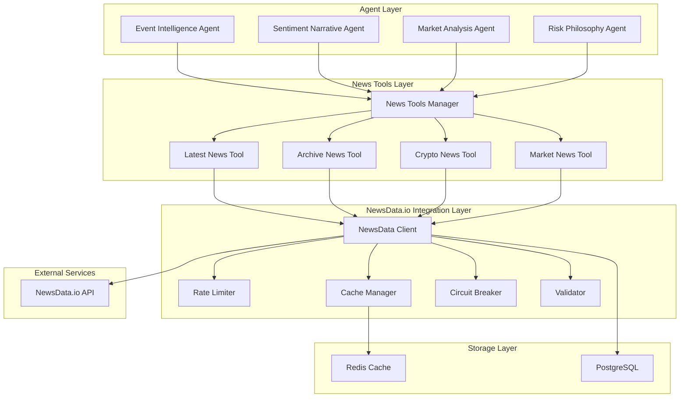

# Design Document: NewsData.io Agent Tools Integration

## Overview

This design document outlines the architecture for migrating from NewsAPI to NewsData.io and implementing agent-based news fetching tools. The new system will provide agents with direct access to comprehensive news data through specialized tools, replacing the current centralized news fetching approach.

The design focuses on creating a robust, scalable, and efficient news integration system that leverages NewsData.io's superior features including multiple endpoints, advanced filtering, AI-powered categorization, and better rate limits.

## Architecture

### High-Level Architecture



### Component Architecture

The system is organized into four main layers:

1. **Agent Layer**: Individual agents that need news data for their analysis
2. **News Tools Layer**: Specialized tools that agents can call to fetch different types of news
3. **NewsData.io Integration Layer**: Core integration components handling API communication, caching, and resilience
4. **Storage Layer**: Persistent storage for caching and configuration

## Components and Interfaces

### NewsData Client

The core client responsible for communicating with NewsData.io API:

```typescript
interface NewsDataClient {
  // Core API methods
  fetchLatestNews(params: LatestNewsParams): Promise<NewsResponse>;
  fetchArchiveNews(params: ArchiveNewsParams): Promise<NewsResponse>;
  fetchCryptoNews(params: CryptoNewsParams): Promise<NewsResponse>;
  fetchMarketNews(params: MarketNewsParams): Promise<NewsResponse>;
  
  // Utility methods
  validateApiKey(): Promise<boolean>;
  getApiQuotaStatus(): Promise<QuotaStatus>;
  testConnection(): Promise<boolean>;
}

interface NewsResponse {
  status: 'success' | 'error';
  totalResults: number;
  results: NewsArticle[];
  nextPage?: string;
  error?: {
    code: string;
    message: string;
  };
}

interface NewsArticle {
  article_id: string;
  title: string;
  link: string;
  keywords?: string[];
  creator?: string[];
  video_url?: string;
  description: string;
  content?: string;
  pubDate: string;
  pubDateTZ?: string;
  image_url?: string;
  source_id: string;
  source_name: string;
  source_url: string;
  source_icon?: string;
  source_priority: number;
  country: string[];
  category: string[];
  language: string;
  ai_tag?: string[];
  sentiment?: 'positive' | 'negative' | 'neutral';
  sentiment_stats?: {
    positive: number;
    negative: number;
    neutral: number;
  };
  ai_region?: string[];
  ai_org?: string[];
  ai_summary?: string;
  datatype?: string;
  duplicate: boolean;
  coin?: string[];
  symbol?: string[];
}
```

### News Tools for Agents

Each tool provides a specific interface for different types of news:

```typescript
interface LatestNewsTool {
  name: 'fetchLatestNews';
  description: 'Fetch the latest news articles from the past 48 hours';
  parameters: {
    q?: string; // Search query
    qInTitle?: string; // Search in title only
    country?: string[]; // Country codes
    category?: string[]; // News categories
    language?: string[]; // Language codes
    domain?: string[]; // Specific domains
    timeframe?: string; // Time window (1-48h or 1m-2880m)
    sentiment?: 'positive' | 'negative' | 'neutral';
    size?: number; // Number of articles (1-50)
    full_content?: boolean;
    image?: boolean;
    video?: boolean;
  };
  execute(params: LatestNewsParams): Promise<NewsArticle[]>;
}

interface ArchiveNewsTool {
  name: 'fetchArchiveNews';
  description: 'Fetch historical news articles with date range filtering';
  parameters: {
    from_date: string; // Required: YYYY-MM-DD or YYYY-MM-DD HH:MM:SS
    to_date: string; // Required: YYYY-MM-DD or YYYY-MM-DD HH:MM:SS
    q?: string;
    qInTitle?: string;
    country?: string[];
    category?: string[];
    language?: string[];
    domain?: string[];
    size?: number;
    full_content?: boolean;
  };
  execute(params: ArchiveNewsParams): Promise<NewsArticle[]>;
}

interface CryptoNewsTool {
  name: 'fetchCryptoNews';
  description: 'Fetch cryptocurrency and blockchain related news';
  parameters: {
    coin?: string[]; // Crypto symbols (btc, eth, etc.)
    q?: string;
    qInTitle?: string;
    language?: string[];
    domain?: string[];
    timeframe?: string;
    sentiment?: 'positive' | 'negative' | 'neutral';
    size?: number;
    full_content?: boolean;
  };
  execute(params: CryptoNewsParams): Promise<NewsArticle[]>;
}

interface MarketNewsTool {
  name: 'fetchMarketNews';
  description: 'Fetch financial and business market news';
  parameters: {
    symbol?: string[]; // Stock symbols (AAPL, TSLA, etc.)
    organization?: string[]; // Company names
    q?: string;
    qInTitle?: string;
    country?: string[];
    language?: string[];
    domain?: string[];
    timeframe?: string;
    sentiment?: 'positive' | 'negative' | 'neutral';
    tag?: string[]; // AI tags for market news
    size?: number;
    full_content?: boolean;
  };
  execute(params: MarketNewsParams): Promise<NewsArticle[]>;
}
```

### Rate Limiter

Advanced rate limiting with multiple strategies:

```typescript
interface RateLimiter {
  // Token bucket for smooth rate limiting
  tryConsume(tokens: number, bucket: string): Promise<boolean>;
  
  // Get current token count
  getTokens(bucket: string): number;
  
  // Check if request would be allowed
  canMakeRequest(bucket: string): boolean;
  
  // Get time until next token available
  getTimeUntilToken(bucket: string): number;
  
  // Reset bucket (for daily quota resets)
  resetBucket(bucket: string): void;
}

interface RateLimitConfig {
  buckets: {
    [key: string]: {
      capacity: number; // Maximum tokens
      refillRate: number; // Tokens per second
      dailyQuota: number; // Daily limit
    };
  };
}
```

### Cache Manager

Intelligent caching with multiple TTL strategies:

```typescript
interface CacheManager {
  // Get cached data
  get<T>(key: string): Promise<CachedData<T> | null>;
  
  // Set cached data with TTL
  set<T>(key: string, data: T, ttl?: number): Promise<void>;
  
  // Check if key exists
  has(key: string): Promise<boolean>;
  
  // Delete cached data
  delete(key: string): Promise<void>;
  
  // Clear all cache
  clear(): Promise<void>;
  
  // Get cache statistics
  getStats(): Promise<CacheStats>;
}

interface CachedData<T> {
  data: T;
  timestamp: number;
  ttl: number;
  isStale: boolean;
  hitCount: number;
}

interface CacheStats {
  totalKeys: number;
  hitRate: number;
  missRate: number;
  memoryUsage: number;
  staleKeys: number;
}
```

### Circuit Breaker

Resilience pattern for handling API failures:

```typescript
interface CircuitBreaker {
  // Execute function with circuit breaker protection
  execute<T>(fn: () => Promise<T>): Promise<T>;
  
  // Get current state
  getState(): CircuitBreakerState;
  
  // Get failure statistics
  getStats(): CircuitBreakerStats;
  
  // Manually trip the circuit
  trip(): void;
  
  // Manually reset the circuit
  reset(): void;
}

enum CircuitBreakerState {
  CLOSED = 'closed',
  OPEN = 'open',
  HALF_OPEN = 'half_open'
}

interface CircuitBreakerStats {
  state: CircuitBreakerState;
  failureCount: number;
  successCount: number;
  lastFailureTime?: number;
  nextAttemptTime?: number;
}
```

## Data Models

### Configuration Model

```typescript
interface NewsDataConfig {
  apiKey: string;
  baseUrl: string;
  timeout: number;
  retryAttempts: number;
  retryDelay: number;
  
  rateLimits: {
    latest: RateLimitConfig;
    archive: RateLimitConfig;
    crypto: RateLimitConfig;
    market: RateLimitConfig;
  };
  
  cache: {
    ttl: {
      latest: number;
      archive: number;
      crypto: number;
      market: number;
    };
    maxSize: number;
    evictionPolicy: 'lru' | 'lfu' | 'ttl';
  };
  
  circuitBreaker: {
    failureThreshold: number;
    resetTimeout: number;
    monitoringPeriod: number;
  };
  
  defaults: {
    size: number;
    language: string[];
    full_content: boolean;
    removeduplicate: boolean;
  };
}
```

### Request/Response Models

```typescript
interface BaseNewsParams {
  q?: string;
  qInTitle?: string;
  qInMeta?: string;
  language?: string[];
  domain?: string[];
  domainurl?: string[];
  excludedomain?: string[];
  size?: number;
  full_content?: boolean;
  image?: boolean;
  video?: boolean;
  removeduplicate?: boolean;
  sort?: 'relevancy' | 'pubdateasc' | 'source' | 'fetched_at';
  excludefield?: string[];
  prioritydomain?: 'top' | 'medium' | 'low';
  timezone?: string;
}

interface LatestNewsParams extends BaseNewsParams {
  id?: string[];
  timeframe?: string;
  country?: string[];
  excludecountry?: string[];
  category?: string[];
  excludecategory?: string[];
  excludelanguage?: string[];
  datatype?: string[];
  sentiment_score?: number;
  creator?: string[];
  url?: string;
  tag?: string[];
  sentiment?: 'positive' | 'negative' | 'neutral';
  organization?: string[];
  region?: string[];
  page?: string;
}

interface ArchiveNewsParams extends BaseNewsParams {
  from_date: string;
  to_date: string;
  id?: string[];
  country?: string[];
  excludecountry?: string[];
  category?: string[];
  excludecategory?: string[];
  excludelanguage?: string[];
  url?: string;
  page?: string;
}

interface CryptoNewsParams extends BaseNewsParams {
  id?: string[];
  coin?: string[];
  from_date?: string;
  to_date?: string;
  timeframe?: string;
  excludelanguage?: string[];
  url?: string;
  tag?: string[];
  sentiment?: 'positive' | 'negative' | 'neutral';
  page?: string;
}

interface MarketNewsParams extends BaseNewsParams {
  id?: string[];
  timeframe?: string;
  from_date?: string;
  to_date?: string;
  country?: string[];
  excludecountry?: string[];
  excludelanguage?: string[];
  symbol?: string[];
  organization?: string[];
  tag?: string[];
  sentiment?: 'positive' | 'negative' | 'neutral';
  datatype?: string[];
  sentiment_score?: number;
  creator?: string[];
  url?: string;
  page?: string;
}
```

## Correctness Properties

*A property is a characteristic or behavior that should hold true across all valid executions of a system—essentially, a formal statement about what the system should do. Properties serve as the bridge between human-readable specifications and machine-verifiable correctness guarantees.*

Now I'll analyze the acceptance criteria to determine which ones are testable as properties:

<function_calls>
<invoke name="prework">
<parameter name="featureName">newsdata-agent-tools

### Property Reflection

After analyzing all acceptance criteria, I identified several areas where properties can be consolidated:

1. **Endpoint Selection Properties (1.2-1.5)** can be combined into a single property about correct endpoint routing
2. **Filter Support Properties (3.1-3.10)** can be grouped by filter type rather than having separate properties for each
3. **Cache Behavior Properties (4.1-4.6)** cover different aspects and should remain separate
4. **Rate Limiting Properties (5.1-5.6)** cover different aspects and should remain separate
5. **Data Validation Properties (9.1-9.7)** can be grouped by validation type

The properties provide comprehensive coverage without significant redundancy.

### Correctness Properties

Based on the prework analysis, here are the key correctness properties that will be implemented:

**Property 1: Endpoint Routing Correctness**
*For any* news request type (latest, archive, crypto, market), the system should route to the correct NewsData.io API endpoint
**Validates: Requirements 1.2, 1.3, 1.4, 1.5**

**Property 2: Tool Interface Completeness**
*For any* agent requesting news functionality, all four news tools (fetchLatestNews, fetchArchiveNews, fetchCryptoNews, fetchMarketNews) should be available
**Validates: Requirements 2.1, 2.2, 2.3, 2.4**

**Property 3: Parameter Acceptance**
*For any* news tool call, all valid filter parameters should be accepted and properly processed without errors
**Validates: Requirements 2.5**

**Property 4: Response Structure Validation**
*For any* successful news tool response, the returned data should contain all required NewsArticle fields with proper types
**Validates: Requirements 2.6**

**Property 5: Error Handling Consistency**
*For any* news tool error condition, meaningful error messages should be returned without system crashes
**Validates: Requirements 2.7, 1.6, 6.6**

**Property 6: Filter Functionality**
*For any* supported filter parameter (keyword, country, language, category, domain, date, sentiment, AI tag, organization, symbol), applying the filter should return only articles matching the criteria
**Validates: Requirements 3.1, 3.2, 3.3, 3.4, 3.5, 3.6, 3.7, 3.8, 3.9, 3.10**

**Property 7: Cache Hit Behavior**
*For any* identical news request made within cache TTL, the cached data should be returned without making a new API call
**Validates: Requirements 4.2**

**Property 8: Cache Staleness Handling**
*For any* expired cached data, it should be marked as stale but remain available for fallback scenarios
**Validates: Requirements 4.3, 4.4**

**Property 9: Cache Eviction Policy**
*For any* cache that exceeds storage limits, the least recently used entries should be evicted first
**Validates: Requirements 4.5**

**Property 10: Rate Limit Tracking**
*For any* API request, the usage should be tracked against the appropriate daily quota bucket
**Validates: Requirements 5.1**

**Property 11: Rate Limit Throttling**
*For any* request when quota limits are approached, the system should throttle or return cached data instead of exceeding quotas
**Validates: Requirements 5.2, 5.3**

**Property 12: Quota Reset Behavior**
*For any* daily quota reset event, all usage counters should be reset to zero
**Validates: Requirements 5.4**

**Property 13: Concurrent Request Coordination**
*For any* simultaneous news requests from multiple agents, the rate limiter should coordinate to prevent quota exhaustion
**Validates: Requirements 5.5**

**Property 14: Circuit Breaker State Management**
*For any* sequence of API failures exceeding the threshold, the circuit breaker should transition to open state and return cached data
**Validates: Requirements 6.1, 6.2, 6.3**

**Property 15: Circuit Breaker Recovery**
*For any* circuit breaker in open state, it should gradually transition to half-open and then closed as the service recovers
**Validates: Requirements 6.4**

**Property 16: Retry Logic with Backoff**
*For any* transient network error, the system should implement exponential backoff retry logic
**Validates: Requirements 6.5, 5.6**

**Property 17: Data Validation Completeness**
*For any* received news article, all required fields should be validated for presence, format, and value ranges
**Validates: Requirements 9.1, 9.2, 9.3, 9.5**

**Property 18: Duplicate Article Filtering**
*For any* news response containing duplicate articles, only unique articles should be returned to the agent
**Validates: Requirements 9.4**

**Property 19: Content Sanitization**
*For any* news article text content, it should be sanitized and normalized before being returned to agents
**Validates: Requirements 9.6**

**Property 20: Invalid Data Exclusion**
*For any* invalid or malformed news article, it should be logged and excluded from the response
**Validates: Requirements 9.7**

## Error Handling

### Error Categories

1. **API Errors**: HTTP errors, authentication failures, quota exceeded
2. **Network Errors**: Timeouts, connection failures, DNS resolution issues
3. **Data Errors**: Invalid response format, missing required fields, malformed data
4. **System Errors**: Cache failures, database connection issues, configuration errors

### Error Handling Strategy

```typescript
interface ErrorHandler {
  handleApiError(error: ApiError): Promise<NewsResponse>;
  handleNetworkError(error: NetworkError): Promise<NewsResponse>;
  handleDataError(error: DataError): Promise<NewsResponse>;
  handleSystemError(error: SystemError): Promise<NewsResponse>;
}

class NewsDataErrorHandler implements ErrorHandler {
  async handleApiError(error: ApiError): Promise<NewsResponse> {
    switch (error.status) {
      case 401:
        // Invalid API key - log and return error
        logger.error('NewsData.io API key invalid or expired');
        return { status: 'error', error: { code: 'AUTH_FAILED', message: 'API authentication failed' } };
      
      case 429:
        // Rate limit exceeded - return cached data if available
        logger.warn('NewsData.io rate limit exceeded, falling back to cache');
        const cached = await this.cacheManager.getStaleData(error.requestKey);
        return cached || { status: 'error', error: { code: 'RATE_LIMIT', message: 'Rate limit exceeded' } };
      
      case 500:
        // Server error - circuit breaker should handle this
        throw error; // Let circuit breaker handle
      
      default:
        logger.error(`NewsData.io API error: ${error.status} - ${error.message}`);
        return { status: 'error', error: { code: 'API_ERROR', message: error.message } };
    }
  }
  
  async handleNetworkError(error: NetworkError): Promise<NewsResponse> {
    // Network errors should trigger retry logic and circuit breaker
    logger.warn(`Network error: ${error.message}, will retry with backoff`);
    throw error; // Let retry logic handle
  }
  
  async handleDataError(error: DataError): Promise<NewsResponse> {
    // Data validation errors - log and filter out invalid articles
    logger.warn(`Data validation error: ${error.message}`);
    return {
      status: 'success',
      totalResults: error.validArticles.length,
      results: error.validArticles
    };
  }
  
  async handleSystemError(error: SystemError): Promise<NewsResponse> {
    // System errors - log and return cached data if available
    logger.error(`System error: ${error.message}`);
    const cached = await this.cacheManager.getStaleData(error.requestKey);
    return cached || { status: 'error', error: { code: 'SYSTEM_ERROR', message: 'System temporarily unavailable' } };
  }
}
```

### Graceful Degradation

The system implements multiple levels of graceful degradation:

1. **Fresh Data → Stale Cache → Error Response**
2. **Primary Endpoint → Circuit Breaker → Cached Fallback**
3. **Full Response → Partial Response → Error Response**

## Testing Strategy

### Dual Testing Approach

The system will use both unit tests and property-based tests for comprehensive coverage:

**Unit Tests** focus on:
- Specific API endpoint configurations
- Error handling scenarios
- Cache hit/miss behaviors
- Circuit breaker state transitions
- Data validation edge cases

**Property-Based Tests** focus on:
- Universal properties across all news types
- Filter parameter combinations
- Rate limiting behaviors
- Cache consistency properties
- Data validation rules

### Property-Based Testing Configuration

- **Testing Framework**: fast-check for TypeScript
- **Minimum Iterations**: 100 per property test
- **Test Tags**: Each property test will be tagged with format: **Feature: newsdata-agent-tools, Property {number}: {property_text}**

### Test Categories

1. **Integration Tests**: End-to-end testing with NewsData.io API
2. **Unit Tests**: Individual component testing
3. **Property Tests**: Universal behavior validation
4. **Performance Tests**: Rate limiting and caching performance
5. **Resilience Tests**: Circuit breaker and error handling

### Example Property Test

```typescript
// Property 6: Filter Functionality
test('Feature: newsdata-agent-tools, Property 6: Filter functionality', async () => {
  await fc.assert(fc.asyncProperty(
    fc.record({
      q: fc.option(fc.string()),
      country: fc.option(fc.array(fc.constantFrom('us', 'uk', 'ca'), { minLength: 1, maxLength: 3 })),
      category: fc.option(fc.array(fc.constantFrom('business', 'technology', 'sports'), { minLength: 1, maxLength: 2 })),
      language: fc.option(fc.array(fc.constantFrom('en', 'es', 'fr'), { minLength: 1, maxLength: 2 }))
    }),
    async (filters) => {
      const result = await newsTools.fetchLatestNews(filters);
      
      // All returned articles should match the applied filters
      if (filters.country) {
        result.forEach(article => {
          expect(article.country.some(c => filters.country!.includes(c))).toBe(true);
        });
      }
      
      if (filters.category) {
        result.forEach(article => {
          expect(article.category.some(c => filters.category!.includes(c))).toBe(true);
        });
      }
      
      if (filters.language) {
        result.forEach(article => {
          expect(filters.language!.includes(article.language)).toBe(true);
        });
      }
    }
  ), { numRuns: 100 });
});
```

This comprehensive design provides a robust foundation for implementing the NewsData.io agent tools integration with proper error handling, caching, rate limiting, and extensive testing coverage.