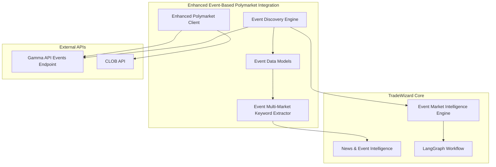

# Design Document: Polymarket Integration Enhancement

## Overview

This design enhances the TradeWizard system's Polymarket integration by implementing event-based analysis using proper Gamma API usage, accurate data models, and comprehensive political event discovery. The enhancement shifts from market-centric to event-centric analysis, enabling comprehensive understanding of market relationships, cross-market opportunities, and event-level intelligence that considers all constituent markets simultaneously.

The design focuses on leveraging Polymarket's event structure where events contain multiple related markets, providing richer context through event-level metadata, tags, and market interdependencies for improved intelligence gathering capabilities.

## Architecture

### High-Level Architecture



### Component Interaction Flow

1. **Event Discovery**: Enhanced Discovery Engine queries Gamma API events endpoint with political tag filtering
2. **Event Processing**: Enhanced Client transforms event API responses with nested markets using accurate data models
3. **Multi-Market Keyword Extraction**: Event-based extractor generates keywords from event tags and all constituent markets
4. **Event Intelligence Integration**: Enhanced event data flows into existing market intelligence pipeline for comprehensive analysis

## Components and Interfaces

### Enhanced Event-Based Polymarket Client

**Purpose**: Provides comprehensive Polymarket events API integration with proper endpoint usage and multi-market data handling.

**Key Interfaces**:

```typescript
interface EnhancedEventPolymarketClient {
  // Event Discovery
  discoverPoliticalEvents(options: EventDiscoveryOptions): Promise<PolymarketEvent[]>
  fetchEventsByTag(tagId: number, options: TagFilterOptions): Promise<PolymarketEvent[]>
  
  // Individual Event Data
  fetchEventDetails(eventId: string): Promise<PolymarketEvent>
  fetchEventWithAllMarkets(eventId: string): Promise<EventWithMarkets>
  
  // Bulk Operations
  fetchEventsBatch(eventIds: string[]): Promise<PolymarketEvent[]>
  
  // Health and Status
  checkEventsApiHealth(): Promise<ApiHealthStatus>
  getRateLimitStatus(): Promise<RateLimitStatus>
}

interface EventDiscoveryOptions {
  tagId?: number
  relatedTags?: boolean
  active?: boolean
  closed?: boolean
  limit?: number
  offset?: number
  startDateMin?: string
  startDateMax?: string
  endDateMin?: string
  endDateMax?: string
  sortBy?: 'volume24hr' | 'liquidity' | 'competitive' | 'createdAt'
  sortOrder?: 'asc' | 'desc'
  archived?: boolean
  featured?: boolean
}

interface EventWithMarkets {
  event: PolymarketEvent
  markets: PolymarketMarket[]
  crossMarketCorrelations: MarketCorrelation[]
  eventLevelMetrics: EventMetrics
}
```

### Enhanced Event Data Models

**Purpose**: Accurate TypeScript interfaces matching actual Polymarket events API responses with nested markets.

**Core Models**:

```typescript
interface PolymarketEvent {
  // Core Event Data
  id: string
  ticker: string
  slug: string
  title: string
  description: string
  resolutionSource: string
  
  // Event Status
  active: boolean
  closed: boolean
  archived: boolean
  new: boolean
  featured: boolean
  restricted: boolean
  
  // Temporal Data
  startDate: string
  creationDate: string
  endDate: string
  createdAt: string
  updatedAt: string
  
  // Event Metrics (aggregated from all markets)
  liquidity: number
  volume: number
  openInterest: number
  competitive: number
  volume24hr: number
  volume1wk: number
  volume1mo: number
  volume1yr: number
  
  // Event Configuration
  enableOrderBook: boolean
  liquidityClob: number
  negRisk: boolean
  negRiskMarketID?: string
  commentCount: number
  
  // Visual Elements
  image?: string
  icon?: string
  
  // Nested Markets (key difference from individual market approach)
  markets: PolymarketMarket[]
  
  // Event Tags and Classification
  tags: PolymarketTag[]
  
  // Event-Specific Configuration
  cyom: boolean
  showAllOutcomes: boolean
  showMarketImages: boolean
  enableNegRisk: boolean
  automaticallyActive: boolean
  gmpChartMode: string
  negRiskAugmented: boolean
  cumulativeMarkets: boolean
  pendingDeployment: boolean
  deploying: boolean
  requiresTranslation: boolean
}

interface PolymarketMarket {
  // Core Market Data (within event context)
  id: string
  question: string
  conditionId: string
  slug: string
  description: string
  resolutionSource: string
  
  // Market Status
  active: boolean
  closed: boolean
  archived: boolean
  new: boolean
  featured: boolean
  restricted: boolean
  
  // Financial Data
  liquidity?: string
  liquidityNum?: number
  volume: string
  volumeNum: number
  volume24hr?: number
  volume1wk?: number
  volume1mo?: number
  volume1yr?: number
  
  // Pricing Data
  outcomes: string  // JSON array as string
  outcomePrices: string  // JSON array as string
  lastTradePrice?: number
  bestBid?: number
  bestAsk?: number
  spread?: number
  
  // Price Changes
  oneDayPriceChange?: number
  oneHourPriceChange?: number
  oneWeekPriceChange?: number
  oneMonthPriceChange?: number
  oneYearPriceChange?: number
  
  // Market Quality Metrics
  competitive?: number
  
  // Temporal Data
  startDate: string
  endDate: string
  createdAt: string
  updatedAt: string
  closedTime?: string
  
  // Market Maker and Trading
  marketMakerAddress: string
  submitted_by: string
  resolvedBy?: string
  
  // Group/Series Information (for event context)
  groupItemTitle?: string
  groupItemThreshold?: string
  
  // UMA Resolution
  questionID?: string
  umaEndDate?: string
  umaResolutionStatus?: string
  umaResolutionStatuses?: string
  umaBond?: string
  umaReward?: string
  
  // Trading Configuration
  enableOrderBook: boolean
  orderPriceMinTickSize?: number
  orderMinSize?: number
  acceptingOrders?: boolean
  acceptingOrdersTimestamp?: string
  
  // CLOB Token Information
  clobTokenIds?: string
  liquidityClob?: number
  volumeClob?: number
  volume24hrClob?: number
  volume1wkClob?: number
  volume1moClob?: number
  volume1yrClob?: number
  
  // Additional Configuration
  customLiveness?: number
  negRisk: boolean
  negRiskRequestID?: string
  negRiskMarketID?: string
  ready: boolean
  funded: boolean
  cyom: boolean
  pagerDutyNotificationEnabled: boolean
  approved: boolean
  rewardsMinSize?: number
  rewardsMaxSpread?: number
  automaticallyResolved?: boolean
  automaticallyActive: boolean
  clearBookOnStart: boolean
  seriesColor: string
  showGmpSeries: boolean
  showGmpOutcome: boolean
  manualActivation: boolean
  negRiskOther: boolean
  pendingDeployment: boolean
  deploying: boolean
  deployingTimestamp?: string
  rfqEnabled: boolean
  holdingRewardsEnabled: boolean
  feesEnabled: boolean
  requiresTranslation: boolean
  
  // Visual Elements
  image?: string
  icon?: string
  
  // Date Helpers
  endDateIso?: string
  startDateIso?: string
  hasReviewedDates?: boolean
}

interface PolymarketTag {
  id: number
  label: string
  slug: string
  forceShow?: boolean
  forceHide?: boolean
  publishedAt?: string
  updatedBy?: number
  createdAt: string
  updatedAt: string
  isCarousel?: boolean
  requiresTranslation: boolean
}

interface EventMetrics {
  totalVolume: number
  totalLiquidity: number
  averageCompetitive: number
  marketCount: number
  activeMarketCount: number
  volumeDistribution: MarketVolumeDistribution[]
  priceCorrelations: MarketCorrelation[]
}

interface MarketCorrelation {
  market1Id: string
  market2Id: string
  correlationCoefficient: number
  correlationType: 'positive' | 'negative' | 'neutral'
}

interface MarketVolumeDistribution {
  marketId: string
  volumePercentage: number
  liquidityPercentage: number
}
```

### Enhanced Event Discovery Engine

**Purpose**: Implements proper political event discovery using Gamma API events endpoint with tag-based filtering and multi-market analysis.

**Key Features**:

```typescript
interface EnhancedEventDiscoveryEngine {
  // Primary Discovery Methods
  discoverTrendingPoliticalEvents(limit: number): Promise<RankedEvent[]>
  discoverEventsByTags(tagIds: number[], options: DiscoveryOptions): Promise<RankedEvent[]>
  discoverRecentPoliticalEvents(timeWindow: number): Promise<RankedEvent[]>
  
  // Filtering and Ranking
  filterPoliticalEvents(events: PolymarketEvent[]): Promise<PolymarketEvent[]>
  rankEventsByTrendingScore(events: PolymarketEvent[]): Promise<RankedEvent[]>
  calculateEventTrendingScore(event: PolymarketEvent): number
  
  // Multi-Market Analysis
  analyzeEventMarketRelationships(event: PolymarketEvent): Promise<EventAnalysis>
  calculateCrossMarketCorrelations(markets: PolymarketMarket[]): Promise<MarketCorrelation[]>
  
  // Tag-Based Operations
  getPoliticalTags(): Promise<PolymarketTag[]>
  getRelatedTags(primaryTagId: number): Promise<PolymarketTag[]>
  
  // Pagination Support
  discoverEventsWithPagination(options: PaginatedDiscoveryOptions): Promise<PaginatedEventResult>
}

interface RankedEvent {
  event: PolymarketEvent
  trendingScore: number
  rankingFactors: {
    totalVolumeScore: number
    totalLiquidityScore: number
    averageCompetitiveScore: number
    marketCountScore: number
    recencyScore: number
    activityScore: number
  }
  marketAnalysis: EventMarketAnalysis
}

interface EventMarketAnalysis {
  marketCount: number
  activeMarketCount: number
  totalVolume: number
  totalLiquidity: number
  averageCompetitive: number
  volumeDistribution: MarketVolumeDistribution[]
  correlations: MarketCorrelation[]
  dominantMarket: PolymarketMarket
  opportunityMarkets: PolymarketMarket[]
}

interface PaginatedEventResult {
  events: RankedEvent[]
  pagination: {
    total: number
    limit: number
    offset: number
    hasMore: boolean
  }
}

interface EventAnalysis {
  event: PolymarketEvent
  marketRelationships: MarketRelationship[]
  crossMarketOpportunities: CrossMarketOpportunity[]
  riskFactors: EventRiskFactor[]
  recommendedStrategy: EventStrategy
}

interface MarketRelationship {
  market1: PolymarketMarket
  market2: PolymarketMarket
  relationshipType: 'complementary' | 'competitive' | 'independent' | 'correlated'
  strength: number
  description: string
}

interface CrossMarketOpportunity {
  type: 'arbitrage' | 'hedge' | 'correlation_play'
  markets: PolymarketMarket[]
  expectedReturn: number
  riskLevel: 'low' | 'medium' | 'high'
  description: string
}

interface EventRiskFactor {
  type: 'correlation_risk' | 'liquidity_risk' | 'resolution_risk' | 'timing_risk'
  severity: 'low' | 'medium' | 'high'
  affectedMarkets: string[]
  description: string
  mitigation: string
}

interface EventStrategy {
  type: 'single_market' | 'multi_market' | 'hedge' | 'arbitrage'
  recommendedMarkets: string[]
  allocation: MarketAllocation[]
  expectedOutcome: string
  confidence: number
  timeHorizon: string
}

interface MarketAllocation {
  marketId: string
  percentage: number
  position: 'yes' | 'no'
  reasoning: string
}
```

### Event-Based Multi-Market Keyword Extractor

**Purpose**: Extracts keywords from Polymarket's event structure including event tags and all constituent markets for improved news correlation.

**Implementation**:

```typescript
interface EventMultiMarketKeywordExtractor {
  // Primary Extraction Methods
  extractKeywordsFromEvent(event: PolymarketEvent): EventKeywords
  extractKeywordsFromEventTags(tags: PolymarketTag[]): string[]
  extractKeywordsFromAllMarkets(markets: PolymarketMarket[]): MarketKeywords[]
  
  // Event-Level Processing
  processEventMetadata(event: PolymarketEvent): ProcessedEventKeywords
  combineEventAndMarketKeywords(eventKeywords: string[], marketKeywords: MarketKeywords[]): string[]
  
  // Cross-Market Analysis
  identifyCommonThemes(markets: PolymarketMarket[]): ThemeKeywords[]
  extractEventLevelConcepts(event: PolymarketEvent): ConceptKeywords[]
  
  // Ranking and Filtering
  rankKeywordsByEventRelevance(keywords: string[], event: PolymarketEvent): RankedKeyword[]
  filterKeywordsByPoliticalRelevance(keywords: string[]): string[]
}

interface EventKeywords {
  eventLevel: string[]      // From event title, description, tags
  marketLevel: string[]     // From all constituent markets
  combined: string[]        // Merged and deduplicated
  themes: ThemeKeywords[]   // Cross-market themes
  concepts: ConceptKeywords[] // Event-level concepts
  ranked: RankedKeyword[]
}

interface MarketKeywords {
  marketId: string
  primary: string[]      // From market question
  secondary: string[]    // From market description
  outcomes: string[]     // From outcome labels
}

interface ThemeKeywords {
  theme: string
  keywords: string[]
  marketIds: string[]    // Markets that share this theme
  relevanceScore: number
}

interface ConceptKeywords {
  concept: string
  keywords: string[]
  source: 'event_title' | 'event_description' | 'event_tags' | 'market_pattern'
  confidence: number
}

interface ProcessedEventKeywords {
  eventTags: string[]
  eventTitle: string[]
  eventDescription: string[]
  marketQuestions: string[]
  marketOutcomes: string[]
  derived: string[]      // Processed variations
  political: string[]    // Politically relevant subset
}

interface RankedKeyword {
  keyword: string
  relevanceScore: number
  source: 'event_tag' | 'event_title' | 'event_description' | 'market_question' | 'market_outcome' | 'derived'
  tagId?: number
  marketIds?: string[]   // Markets where this keyword appears
  frequency: number      // How often it appears across markets
}
```

## Data Models

### Enhanced Event Briefing Document

The existing MarketBriefingDocument will be enhanced to support event-based analysis with multiple markets:

```typescript
interface EnhancedEventBriefingDocument extends MarketBriefingDocument {
  // Event-Level Data
  eventData: {
    event: PolymarketEvent
    markets: PolymarketMarket[]
    eventMetrics: EventMetrics
    marketRelationships: MarketRelationship[]
    crossMarketOpportunities: CrossMarketOpportunity[]
  }
  
  // Enhanced Keywords (from event and all markets)
  keywords: EventKeywords
  
  // Enhanced Metadata
  metadata: EnhancedEventMetadata
  
  // Multi-Market Analysis
  marketAnalysis: {
    dominantMarket: PolymarketMarket
    correlatedMarkets: MarketCorrelation[]
    arbitrageOpportunities: ArbitrageOpportunity[]
    riskFactors: EventRiskFactor[]
  }
  
  // Event-Level Intelligence
  eventIntelligence: {
    eventLevelNews: NewsArticle[]
    marketSpecificNews: MarketNewsMapping[]
    eventCatalysts: EventCatalyst[]
    timelineEvents: TimelineEvent[]
  }
}

interface EventMetrics {
  totalVolume: number
  totalLiquidity: number
  averageCompetitive: number
  marketCount: number
  activeMarketCount: number
  volumeDistribution: MarketVolumeDistribution[]
  liquidityDistribution: MarketLiquidityDistribution[]
  priceCorrelations: MarketCorrelation[]
  volatilityMetrics: EventVolatilityMetrics
}

interface MarketNewsMapping {
  marketId: string
  relevantNews: NewsArticle[]
  newsRelevanceScore: number
}

interface ArbitrageOpportunity {
  type: 'price_discrepancy' | 'outcome_correlation' | 'temporal_arbitrage'
  markets: string[]
  expectedReturn: number
  riskLevel: 'low' | 'medium' | 'high'
  timeWindow: string
  description: string
  executionSteps: string[]
}

interface EventVolatilityMetrics {
  eventLevelVolatility: number
  marketVolatilities: MarketVolatility[]
  correlationStability: number
  priceMovementSync: number
}

interface MarketVolatility {
  marketId: string
  volatility: number
  priceRange: { min: number; max: number }
  volatilityTrend: 'increasing' | 'decreasing' | 'stable'
}

interface TimelineEvent {
  timestamp: number
  event: string
  source: 'polymarket_event' | 'market_creation' | 'news' | 'price_movement'
  impact: 'high' | 'medium' | 'low'
  affectedMarkets: string[]
  description: string
}

interface EnhancedEventMetadata extends MarketBriefingDocument['metadata'] {
  // Event-specific metadata
  eventId: string
  eventTitle: string
  eventDescription: string
  marketIds: string[]
  
  // Enhanced catalysts from event analysis
  eventCatalysts: EventCatalyst[]
  marketCatalysts: MarketCatalyst[]
  
  // Tag-derived information
  politicalCategory: string
  subCategories: string[]
  eventThemes: string[]
  
  // Cross-market information
  marketRelationships: MarketRelationship[]
  dominantMarketId: string
  opportunityMarkets: string[]
}

interface MarketCatalyst {
  marketId: string
  catalyst: string
  timestamp: number
  source: 'market_specific' | 'event_level' | 'external'
  impact: 'high' | 'medium' | 'low'
}

interface EventCatalyst {
  event: string
  timestamp: number
  source: 'polymarket_event' | 'news' | 'market_activity' | 'external'
  impact: 'high' | 'medium' | 'low'
  affectedMarkets: string[]
  eventId?: string
}
```

### Configuration Models

```typescript
interface EnhancedEventPolymarketConfig {
  // API Configuration
  gammaApiUrl: string
  eventsApiEndpoint: string      // Specific events endpoint
  clobApiUrl: string
  
  // Political Event Configuration
  politicsTagId: number              // Default: 2
  includeRelatedTags: boolean        // Default: true
  
  // Discovery Configuration
  maxEventsPerDiscovery: number      // Default: 20
  maxMarketsPerEvent: number         // Default: 50
  defaultSortBy: 'volume24hr' | 'liquidity' | 'competitive' | 'marketCount'
  
  // Multi-Market Analysis Configuration
  enableCrossMarketAnalysis: boolean // Default: true
  correlationThreshold: number       // Default: 0.3
  arbitrageThreshold: number         // Default: 0.05
  
  // Rate Limiting
  rateLimitBuffer: number            // Percentage buffer
  maxRequestsPerMinute: number
  eventsApiRateLimit: number         // Specific limit for events endpoint
  
  // Caching
  eventCacheTTL: number              // Seconds
  marketCacheTTL: number             // Seconds
  tagCacheTTL: number                // Seconds
  correlationCacheTTL: number        // Seconds
  
  // Feature Flags
  enableEventBasedKeywords: boolean    // Default: true
  enableMultiMarketAnalysis: boolean   // Default: true
  enableCrossMarketCorrelation: boolean // Default: true
  enableArbitrageDetection: boolean    // Default: true
  enableEventLevelIntelligence: boolean // Default: true
  
  // Error Handling
  maxRetries: number
  circuitBreakerThreshold: number
  fallbackToCache: boolean
  enableGracefulDegradation: boolean   // Continue with partial event data
  
  // Analysis Configuration
  keywordExtractionMode: 'event_priority' | 'market_priority' | 'balanced'
  correlationAnalysisDepth: 'basic' | 'advanced' | 'comprehensive'
  riskAssessmentLevel: 'conservative' | 'moderate' | 'aggressive'
}
```

## Correctness Properties

*A property is a characteristic or behavior that should hold true across all valid executions of a system-essentially, a formal statement about what the system should do. Properties serve as the bridge between human-readable specifications and machine-verifiable correctness guarantees.*

### Property Reflection

After analyzing all acceptance criteria, several properties can be consolidated to eliminate redundancy:

- Properties 1.1, 1.2, and 1.3 all test event API parameter inclusion and can be combined into comprehensive event API parameter validation properties
- Properties 2.1-2.5 all test event data parsing and can be consolidated into comprehensive event parsing properties
- Properties 3.1-3.5 all test multi-market analysis and can be combined into event-level intelligence properties
- Properties 4.1-4.5 all test recommendation generation and can be consolidated into event-based recommendation properties
- Properties 5.1-5.5 all test event monitoring and can be combined into event-level monitoring properties
- Properties 6.1-6.5 all test configuration and can be consolidated into event configuration management properties
- Properties 7.1-7.5 all test error handling and can be consolidated into event error handling properties

### Core Properties

**Property 1: Event-Based Political Discovery API Parameters**
*For any* political event discovery request, the API call should include tag_id=2, related_tags=true, active=true, and closed=false parameters for events endpoint
**Validates: Requirements 1.1, 1.2, 1.3**

**Property 2: Event Nested Markets Inclusion**
*For any* event API response, all nested markets within the event should be included and properly structured in the response
**Validates: Requirements 1.2, 2.1**

**Property 3: Event Filtering and Prioritization**
*For any* event discovery operation, events with multiple active markets and high combined volume should be prioritized over single-market events
**Validates: Requirements 1.3, 1.5**

**Property 4: Event Metadata Extraction Completeness**
*For any* event response, event title, description, tags, and all market relationships should be extracted and properly structured
**Validates: Requirements 1.4, 2.2**

**Property 5: Event Metrics Aggregation**
*For any* event with multiple markets, volume, liquidity, and activity metrics should be aggregated across all constituent markets
**Validates: Requirements 1.5, 2.4**

**Property 6: Event Structure Parsing Completeness**
*For any* valid event API response, the event structure with nested markets array should be successfully parsed into corresponding TypeScript interfaces
**Validates: Requirements 2.1, 2.3**

**Property 7: Market Relationship Preservation**
*For any* event with multiple markets, market relationships and dependencies within the event should be maintained and accessible
**Validates: Requirements 2.3, 3.1**

**Property 8: Cross-Market Intelligence Integration**
*For any* event analysis, insights from all constituent markets should be combined for comprehensive event-level understanding
**Validates: Requirements 3.1, 3.2**

**Property 9: Event-Level Keyword Priority**
*For any* event with tags and multiple markets, keywords should prioritize event-level tags while incorporating market-specific terms
**Validates: Requirements 3.4, 3.5**

**Property 10: Cross-Market Opportunity Detection**
*For any* event with multiple markets, cross-market arbitrage and correlation patterns should be identified and reported
**Validates: Requirements 3.3, 4.2**

**Property 11: Multi-Market Probability Analysis**
*For any* event recommendation generation, probability distributions across all markets in the event should be analyzed collectively
**Validates: Requirements 4.1, 4.5**

**Property 12: Event-Level Risk Assessment**
*For any* event with multiple markets, risk assessment should consider event-level exposure and correlation risks across all markets
**Validates: Requirements 4.3, 4.4**

**Property 13: Event Monitoring Coordination**
*For any* event monitoring operation, all markets within events should be tracked for coordinated changes and cross-market impact
**Validates: Requirements 5.1, 5.2**

**Property 14: Event-Level News Correlation**
*For any* news processing operation, news articles should be correlated to entire events and multi-market impact should be assessed
**Validates: Requirements 5.3, 5.5**

**Property 15: Event Resolution Sequence Tracking**
*For any* event with multiple markets, event progression and market resolution sequences should be monitored and tracked
**Validates: Requirements 5.4**

**Property 16: Event Configuration Environment Support**
*For any* system startup, event-specific environment variables should be properly read and used for configuration with appropriate defaults
**Validates: Requirements 6.1, 6.2, 6.4, 6.5**

**Property 17: Event Discovery Feature Flag Support**
*For any* event discovery operation, feature flags for different discovery modes and multi-market filtering should be properly applied
**Validates: Requirements 6.3**

**Property 18: Event Structure Validation**
*For any* event API response, the event structure and nested markets should be validated against expected schemas
**Validates: Requirements 7.1**

**Property 19: Event Error Resilience**
*For any* malformed event data encountered, errors should be logged and valid events and markets should continue to be processed
**Validates: Requirements 7.2**

**Property 20: Event API Fallback Behavior**
*For any* events API unavailability scenario, the system should fall back to cached event data or alternative endpoints when available
**Validates: Requirements 7.3**

**Property 21: Event Processing Rate Limit Handling**
*For any* rate limit exceeded scenario during event processing, proper backoff strategies and user notification should be implemented
**Validates: Requirements 7.4**

**Property 22: Event Validation Error Reporting**
*For any* event validation failure, detailed error messages should be provided that include sufficient information for debugging event-level issues
**Validates: Requirements 7.5**

## Error Handling

### Error Categories

1. **Event API Errors**
   - Network connectivity issues with events endpoint
   - HTTP status errors (4xx, 5xx) from events API
   - Rate limiting (429 responses) for events requests
   - Authentication failures for events access

2. **Event Data Validation Errors**
   - Malformed event JSON responses
   - Missing required event fields
   - Invalid nested market structures
   - Event schema validation failures

3. **Multi-Market Processing Errors**
   - Cross-market correlation calculation failures
   - Market relationship parsing errors
   - Event metrics aggregation issues
   - Multi-market keyword extraction failures

4. **Event Configuration Errors**
   - Missing event-specific environment variables
   - Invalid event discovery configuration values
   - Multi-market analysis feature flag conflicts

### Error Handling Strategies

**Graceful Degradation for Events**:
- Continue processing valid events when encountering partial failures
- Fall back to cached event data when events API is unavailable
- Process individual markets when event-level analysis fails
- Use default values for missing optional event configuration

**Circuit Breaker Pattern for Events**:
- Monitor events API failure rates
- Open circuit after threshold event API failures
- Implement half-open state for events API recovery testing

**Event-Specific Exponential Backoff**:
- Implement jittered exponential backoff for event API retries
- Respect events API rate limiting headers
- Maximum retry limits to prevent infinite loops for event requests

**Comprehensive Event Logging**:
- Log all event-related errors with sufficient context for debugging
- Include event/market details for event API errors
- Track event processing patterns for monitoring and alerting

## Testing Strategy

### Dual Testing Approach

The system will use both unit tests and property-based tests for comprehensive coverage:

**Unit Tests**:
- Specific examples of event API responses and expected parsing results
- Edge cases like events with no markets or missing event fields
- Error conditions and fallback scenarios for event processing
- Integration points between event components

**Property-Based Tests**:
- Universal properties that hold across all event inputs using fast-check
- Minimum 100 iterations per property test for thorough coverage
- Each property test references its corresponding design document property
- Tag format: **Feature: polymarket-integration-enhancement, Property {number}: {property_text}**

### Property Test Configuration

All property tests will be configured with:
- Minimum 100 iterations to ensure comprehensive event input coverage
- Timeout of 30 seconds to accommodate events API calls during testing
- Proper test isolation to prevent interference between event tests
- Comprehensive input generation covering edge cases and normal event scenarios

### Testing Focus Areas

**Event API Integration Testing**:
- Verify correct parameter inclusion in events API requests
- Test event response parsing with various event API response formats
- Validate error handling with simulated events API failures

**Multi-Market Data Transformation Testing**:
- Test parsing of complete event API responses with nested markets
- Verify keyword extraction from various event and market configurations
- Test ranking algorithms with different event data sets

**Event Configuration Testing**:
- Verify event-specific environment variable reading and default handling
- Test feature flag behavior across different event configurations
- Validate rate limiting and circuit breaker functionality for events API

Each correctness property will be implemented as a single property-based test that validates the universal behavior described in the property statement.