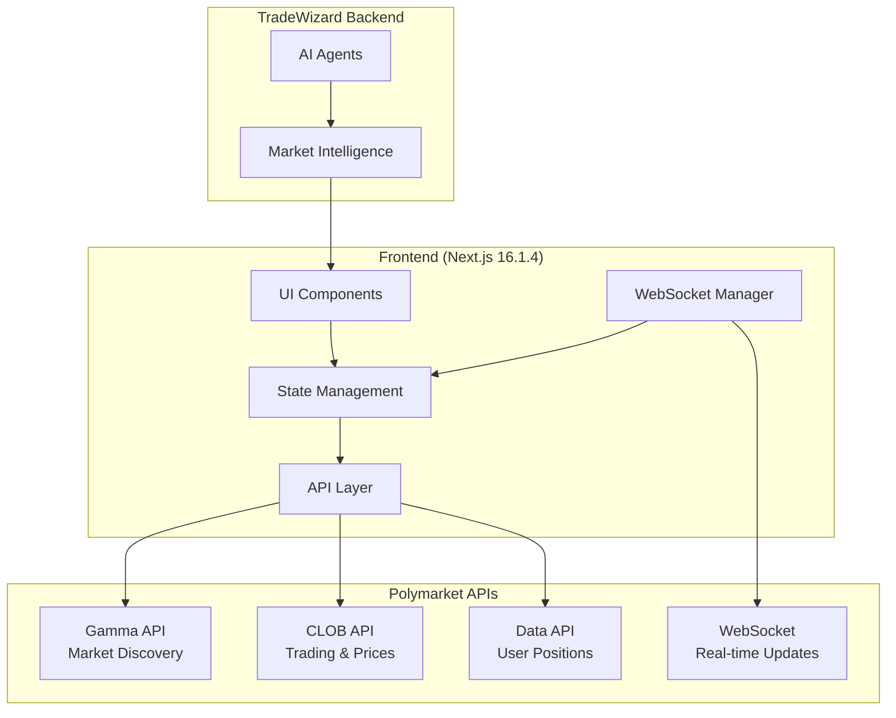
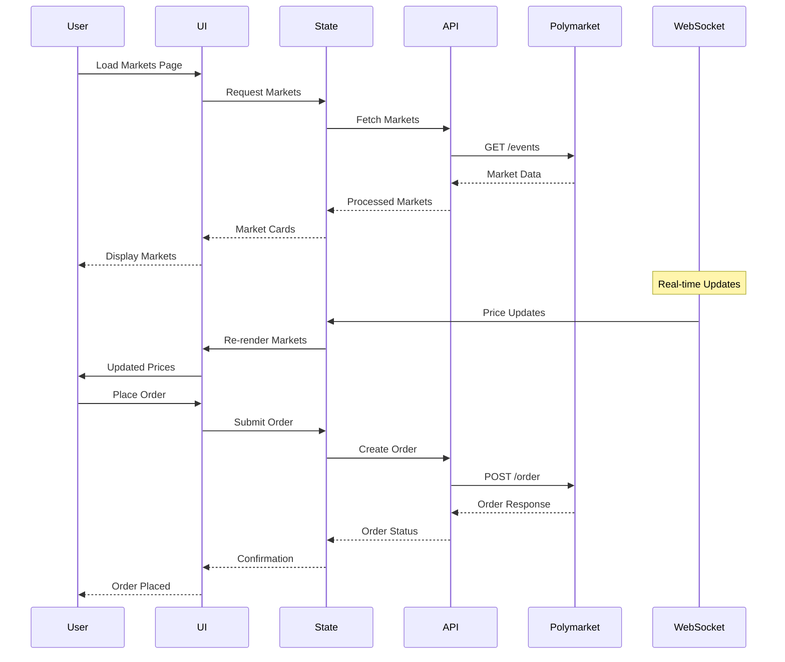

# Design Document

## Overview

This design transforms the TradeWizard frontend into a comprehensive prediction market trading platform that replicates Polymarket's interface and functionality. The system will integrate with Polymarket's APIs to provide real-time market data, trading capabilities, and user portfolio management while maintaining TradeWizard's AI-powered market intelligence features.

The architecture follows a modular approach with clear separation between data fetching, state management, UI components, and trading functionality. Real-time updates are handled through WebSocket connections, while REST APIs provide market discovery and trading operations.

## Architecture

### High-Level Architecture



### Data Flow Architecture



## Components and Interfaces

### Core Components

#### 1. Market Discovery Components

**MarketGrid Component**
```typescript
interface MarketGridProps {
  markets: ProcessedMarket[];
  series: ProcessedSeries[];
  loading: boolean;
  error?: string;
  onMarketClick: (marketSlug: string) => void;
  onSeriesClick: (seriesSlug: string) => void;
  viewMode: 'grid' | 'list';
}
```

**MarketCard Component** (Enhanced)
```typescript
interface MarketCardProps {
  market: ProcessedMarket;
  showAIInsights?: boolean;
  compact?: boolean;
  onClick: (marketSlug: string) => void;
}
```

**SeriesCard Component** (New)
```typescript
interface SeriesCardProps {
  series: ProcessedSeries;
  markets: ProcessedMarket[];
  showAIInsights?: boolean;
  onClick: (seriesSlug: string) => void;
}
```

**CategoryFilter Component**
```typescript
interface CategoryFilterProps {
  politicsTags: PoliticsTag[];
  activeTag: string | null;
  onTagChange: (tagSlug: string | null) => void;
  marketCounts: Record<string, number>;
  showFilterButton?: boolean;
}
```

#### 2. Trading Components

**TradingPanel Component**
```typescript
interface TradingPanelProps {
  market: DetailedMarket;
  userBalance: number;
  onOrderSubmit: (order: OrderRequest) => Promise<void>;
  orderBook: OrderBook;
  userPositions: Position[];
}
```

**OrderForm Component**
```typescript
interface OrderFormProps {
  outcome: MarketOutcome;
  maxPrice: number;
  minPrice: number;
  tickSize: number;
  userBalance: number;
  onSubmit: (order: OrderRequest) => void;
  loading: boolean;
}
```

**OrderBook Component**
```typescript
interface OrderBookProps {
  bids: OrderBookEntry[];
  asks: OrderBookEntry[];
  lastPrice?: number;
  onPriceClick: (price: number) => void;
}
```

#### 3. Real-time Data Components

**PriceChart Component**
```typescript
interface PriceChartProps {
  tokenId: string;
  timeframe: '1h' | '24h' | '7d' | '30d';
  height?: number;
  showVolume?: boolean;
}
```

**LivePriceIndicator Component**
```typescript
interface LivePriceIndicatorProps {
  currentPrice: number;
  previousPrice: number;
  change24h: number;
  animated?: boolean;
}
```

#### 4. User Management Components

**WalletConnection Component**
```typescript
interface WalletConnectionProps {
  onConnect: (address: string) => void;
  onDisconnect: () => void;
  connectedAddress?: string;
  balance?: number;
}
```

**PositionsPanel Component**
```typescript
interface PositionsPanelProps {
  positions: UserPosition[];
  onPositionClick: (position: UserPosition) => void;
  totalValue: number;
  totalPnL: number;
}
```

### API Layer Interfaces

#### Polymarket API Integration

**Market Discovery Service**
```typescript
interface MarketDiscoveryService {
  getEvents(params: GetEventsParams): Promise<PolymarketEvent[]>;
  getMarkets(params: GetMarketsParams): Promise<PolymarketMarket[]>;
  getCategories(): Promise<Category[]>;
  searchMarkets(query: string): Promise<PolymarketMarket[]>;
}
```

**Trading Service**
```typescript
interface TradingService {
  getOrderBook(tokenId: string): Promise<OrderBook>;
  getCurrentPrice(tokenId: string): Promise<number>;
  placeOrder(order: OrderRequest): Promise<OrderResponse>;
  cancelOrder(orderId: string): Promise<void>;
  getUserOrders(address: string): Promise<UserOrder[]>;
  getUserPositions(address: string): Promise<UserPosition[]>;
}
```

**WebSocket Service**
```typescript
interface WebSocketService {
  connect(): void;
  disconnect(): void;
  subscribeToMarket(tokenId: string): void;
  unsubscribeFromMarket(tokenId: string): void;
  subscribeToUser(address: string): void;
  onPriceUpdate(callback: (update: PriceUpdate) => void): void;
  onOrderUpdate(callback: (update: OrderUpdate) => void): void;
}
```

## Data Models

### Core Data Models

**ProcessedMarket Model**
```typescript
interface ProcessedMarket {
  id: string;
  conditionId: string;
  title: string;
  description: string;
  image: string;
  category: string;
  outcomes: MarketOutcome[];
  volume24h: number;
  volumeFormatted: string;
  liquidity: number;
  endDate: string;
  startDate: string;
  active: boolean;
  closed: boolean;
  isNew: boolean;
  featured: boolean;
  slug: string;
  tags: MarketTag[];
  groupItemTitle?: string; // For series grouping
  groupItemThreshold?: string;
  events: MarketEvent[];
  // AI Enhancement fields
  aiInsights?: AIMarketInsights;
  riskLevel?: 'low' | 'medium' | 'high';
  confidence?: number;
}
```

**ProcessedSeries Model** (New)
```typescript
interface ProcessedSeries {
  id: string;
  title: string;
  description: string;
  image: string;
  slug: string;
  seriesType: string;
  recurrence: string;
  markets: ProcessedMarket[];
  totalVolume: number;
  totalLiquidity: number;
  endDate: string; // Earliest end date from markets
  active: boolean;
  tags: MarketTag[];
}
```

**MarketEvent Model** (Enhanced)
```typescript
interface MarketEvent {
  id: string;
  title: string;
  description: string;
  slug: string;
  image: string;
  series?: SeriesInfo; // Optional series information
  startDate: string;
  endDate: string;
  active: boolean;
}

interface SeriesInfo {
  id: string;
  title: string;
  slug: string;
  seriesType: string;
  recurrence: string;
  image: string;
}
```

**MarketTag Model** (Enhanced)
```typescript
interface MarketTag {
  id: string;
  label: string;
  slug: string;
  forceShow: boolean;
  forceHide?: boolean;
  isPolitics: boolean; // New field to identify politics-related tags
}

interface PoliticsTag extends MarketTag {
  isPolitics: true;
  marketCount: number;
}
```

**MarketOutcome Model**
```typescript
interface MarketOutcome {
  name: string;
  tokenId: string;
  probability: number;
  price: number;
  volume24h: number;
  color: 'yes' | 'no' | 'neutral';
  lastPrice?: number;
  priceChange24h?: number;
  bestBid?: number;
  bestAsk?: number;
}
```

**OrderBook Model**
```typescript
interface OrderBook {
  tokenId: string;
  bids: OrderBookEntry[];
  asks: OrderBookEntry[];
  spread: number;
  midPrice: number;
  lastUpdated: number;
}

interface OrderBookEntry {
  price: number;
  size: number;
  total: number;
}
```

**Trading Models**
```typescript
interface OrderRequest {
  tokenId: string;
  side: 'buy' | 'sell';
  price: number;
  size: number;
  orderType: 'limit' | 'market';
  timeInForce: 'GTC' | 'IOC' | 'FOK';
}

interface OrderResponse {
  orderId: string;
  status: 'pending' | 'filled' | 'cancelled' | 'rejected';
  fillPrice?: number;
  fillSize?: number;
  remainingSize?: number;
  timestamp: number;
}

interface UserPosition {
  tokenId: string;
  marketTitle: string;
  outcome: string;
  size: number;
  averagePrice: number;
  currentPrice: number;
  unrealizedPnL: number;
  realizedPnL: number;
  value: number;
}
```

### State Management Models

**Application State**
```typescript
interface AppState {
  markets: {
    items: ProcessedMarket[];
    series: ProcessedSeries[];
    loading: boolean;
    error?: string;
    filters: MarketFilters;
    pagination: PaginationState;
  };
  tags: {
    politicsTags: PoliticsTag[];
    activeTag: string | null;
    loading: boolean;
  };
  trading: {
    activeMarket?: DetailedMarket;
    activeSeries?: ProcessedSeries;
    orderBook?: OrderBook;
    userOrders: UserOrder[];
    pendingOrders: string[];
    orderHistory: CompletedOrder[];
  };
  user: {
    address?: string;
    balance: number;
    positions: UserPosition[];
    connected: boolean;
    connecting: boolean;
  };
  realtime: {
    connected: boolean;
    subscriptions: string[];
    priceUpdates: Record<string, PriceUpdate>;
  };
  ui: {
    theme: 'light' | 'dark';
    viewMode: 'grid' | 'list';
    sidebarOpen: boolean;
    activeModal?: string;
  };
  routing: {
    currentRoute: string;
    marketSlug?: string;
    seriesSlug?: string;
    tagSlug?: string;
  };
}
```

## Correctness Properties

*A property is a characteristic or behavior that should hold true across all valid executions of a system-essentially, a formal statement about what the system should do. Properties serve as the bridge between human-readable specifications and machine-verifiable correctness guarantees.*

Before writing the correctness properties, I need to analyze the acceptance criteria from the requirements document to determine which ones are testable as properties.

<function_calls>
<invoke name="prework">
<parameter name="featureName">polymarket-interface-transformation

### Property Reflection

After analyzing all acceptance criteria, I identified several areas where properties can be consolidated to eliminate redundancy:

**Redundancy Analysis:**
- Properties about information display (market cards, trading interfaces, order displays) can be combined into comprehensive display validation properties
- Color coding properties for outcomes can be consolidated into a single comprehensive color scheme property
- Error handling properties across different components can be unified into general error handling properties
- Accessibility properties can be grouped by interaction type (screen readers, keyboard navigation, etc.)

**Consolidated Properties:**
- Market card display properties (1.2, 1.3, 1.4, 1.6) → Single comprehensive market card validation property
- Trading interface display properties (5.6, 6.3, 6.5, 7.1, 7.2, 7.5) → Single comprehensive trading interface validation property
- Error handling properties (11.1, 11.3, 11.5, 11.6) → Single comprehensive error handling property
- Mobile responsiveness properties (9.2, 9.3, 9.4, 9.5, 9.6) → Single comprehensive mobile interface property

Based on this analysis, the following properties provide unique validation value:

**Property 1: Market Card Information Display**
*For any* market card rendering, the displayed content should include market title, outcome probabilities, 24-hour volume, status indicators, and appropriate visual styling
**Validates: Requirements 1.2, 1.3, 1.4, 1.6**

**Property 2: Category Filtering Behavior**
*For any* category selection, the system should display only markets belonging to that category and highlight the active category
**Validates: Requirements 2.2, 2.3**

**Property 3: WebSocket Reconnection Resilience**
*For any* WebSocket connection failure, the system should attempt reconnection with exponential backoff until successful
**Validates: Requirements 3.3, 11.4**

**Property 4: Price Display Formatting**
*For any* price or probability display, the system should show values with appropriate decimal precision and consistent formatting
**Validates: Requirements 3.4**

**Property 5: Market Navigation Consistency**
*For any* market card click, the system should navigate to the corresponding detailed market view
**Validates: Requirements 4.1**

**Property 6: Market Detail Information Completeness**
*For any* market detail view, the system should display complete market information including description, resolution criteria, end date, volume, liquidity, and outcome data
**Validates: Requirements 4.2, 4.4, 4.5, 4.6**

**Property 7: Order Validation and Processing**
*For any* order submission, the system should validate all parameters, check sufficient balance, and provide appropriate feedback
**Validates: Requirements 5.2, 5.3, 6.4**

**Property 8: Trading Interface Information Display**
*For any* trading interface, the system should display current market depth, order book information, user positions, and order management controls
**Validates: Requirements 5.6, 6.3, 6.5, 7.1, 7.2**

**Property 9: Order State Management**
*For any* order state change (fill, cancellation, modification), the system should update user positions, balance, and order displays immediately
**Validates: Requirements 7.3, 7.4, 7.6**

**Property 10: Search and Filter Functionality**
*For any* search query or filter application, the system should update results immediately with appropriate highlighting and sorting
**Validates: Requirements 8.1, 8.2, 8.5**

**Property 11: Caching and Performance Optimization**
*For any* data fetching operation, the system should implement appropriate caching with 60-second revalidation and lazy loading for images
**Validates: Requirements 10.2, 10.4**

**Property 12: Comprehensive Error Handling**
*For any* error condition (API failures, trading errors, data unavailability), the system should display user-friendly messages, maintain layout integrity, and provide recovery options
**Validates: Requirements 11.1, 11.2, 11.3, 11.5, 11.6**

**Property 13: Mobile Interface Responsiveness**
*For any* mobile device interaction, the system should provide touch-friendly controls, appropriate sizing, responsive layouts, and orientation adaptation
**Validates: Requirements 9.2, 9.3, 9.4, 9.5, 9.6**

**Property 14: Accessibility Compliance**
*For any* interactive element or information display, the system should provide screen reader labels, keyboard navigation, focus indicators, and alternative indicators beyond color
**Validates: Requirements 12.1, 12.2, 12.3, 12.4, 12.5, 12.6**

**Property 15: Series Market Grouping**
*For any* market with series information, the system should group related markets under the series title and display them using groupItemTitle properties
**Validates: Requirements 13.1, 13.2, 13.3, 13.4**

## Error Handling

### Error Categories and Strategies

**API Communication Errors**
- Network timeouts and connection failures
- Rate limiting and quota exceeded errors
- Invalid API responses and data corruption
- Authentication and authorization failures

**Trading Operation Errors**
- Insufficient balance errors
- Invalid order parameters
- Market closure and trading restrictions
- Order execution failures and partial fills

**Real-time Data Errors**
- WebSocket connection interruptions
- Message parsing failures
- Subscription management errors
- Data synchronization issues

**User Interface Errors**
- Component rendering failures
- State management inconsistencies
- Navigation and routing errors
- Form validation and input errors

### Error Handling Implementation

**Graceful Degradation Strategy**
```typescript
interface ErrorBoundaryState {
  hasError: boolean;
  errorType: 'network' | 'trading' | 'rendering' | 'data';
  fallbackData?: any;
  retryCount: number;
  lastError?: Error;
}

class MarketErrorBoundary extends React.Component<Props, ErrorBoundaryState> {
  // Implement error boundary with fallback UI
  // Provide retry mechanisms for recoverable errors
  // Log errors for debugging while showing user-friendly messages
}
```

**Retry Logic with Exponential Backoff**
```typescript
interface RetryConfig {
  maxRetries: number;
  baseDelay: number;
  maxDelay: number;
  backoffFactor: number;
}

async function withRetry<T>(
  operation: () => Promise<T>,
  config: RetryConfig
): Promise<T> {
  // Implement exponential backoff retry logic
  // Handle different error types with appropriate strategies
  // Provide circuit breaker functionality for persistent failures
}
```

## Testing Strategy

### Dual Testing Approach

The testing strategy combines unit tests for specific examples and edge cases with property-based tests for universal properties across all inputs. This comprehensive approach ensures both concrete bug detection and general correctness verification.

**Unit Testing Focus:**
- Specific examples of market data processing and display
- Edge cases like empty markets, network failures, and invalid data
- Integration points between components and external APIs
- User interaction flows and state transitions
- Error conditions and recovery mechanisms

**Property-Based Testing Focus:**
- Universal properties that hold for all market data inputs
- Comprehensive input coverage through randomization
- Invariant preservation across state changes
- Round-trip properties for data serialization and API communication
- UI consistency properties across different screen sizes and devices

### Property-Based Testing Configuration

**Testing Library:** fast-check for TypeScript/JavaScript property-based testing
**Test Configuration:**
- Minimum 100 iterations per property test (due to randomization)
- Each property test references its design document property
- Tag format: **Feature: polymarket-interface-transformation, Property {number}: {property_text}**

**Example Property Test Structure:**
```typescript
import fc from 'fast-check';

describe('Market Card Display Properties', () => {
  it('should display complete market information for any valid market data', () => {
    // Feature: polymarket-interface-transformation, Property 1: Market Card Information Display
    fc.assert(fc.property(
      marketDataArbitrary,
      (marketData) => {
        const rendered = render(<MarketCard market={marketData} />);
        
        // Verify all required information is displayed
        expect(rendered.getByText(marketData.title)).toBeInTheDocument();
        expect(rendered.getByText(marketData.volumeFormatted)).toBeInTheDocument();
        
        // Verify color coding for outcomes
        marketData.outcomes.forEach(outcome => {
          const element = rendered.getByText(`${outcome.probability}%`);
          if (outcome.name === 'Yes') {
            expect(element).toHaveClass('text-emerald-600');
          } else if (outcome.name === 'No') {
            expect(element).toHaveClass('text-red-600');
          }
        });
        
        // Verify new badge display
        if (marketData.isNew) {
          expect(rendered.getByText('New')).toBeInTheDocument();
        }
      }
    ));
  });
});
```

### Integration Testing Strategy

**API Integration Tests:**
- Test real Polymarket API endpoints with mock data
- Verify WebSocket connection and message handling
- Test error scenarios and fallback mechanisms
- Validate data transformation and processing

**End-to-End Testing:**
- Complete user workflows from market discovery to order placement
- Cross-browser compatibility testing
- Mobile device testing across different screen sizes
- Performance testing under various load conditions

**Accessibility Testing:**
- Screen reader compatibility testing
- Keyboard navigation testing
- Color contrast and visual accessibility testing
- ARIA label and semantic HTML validation