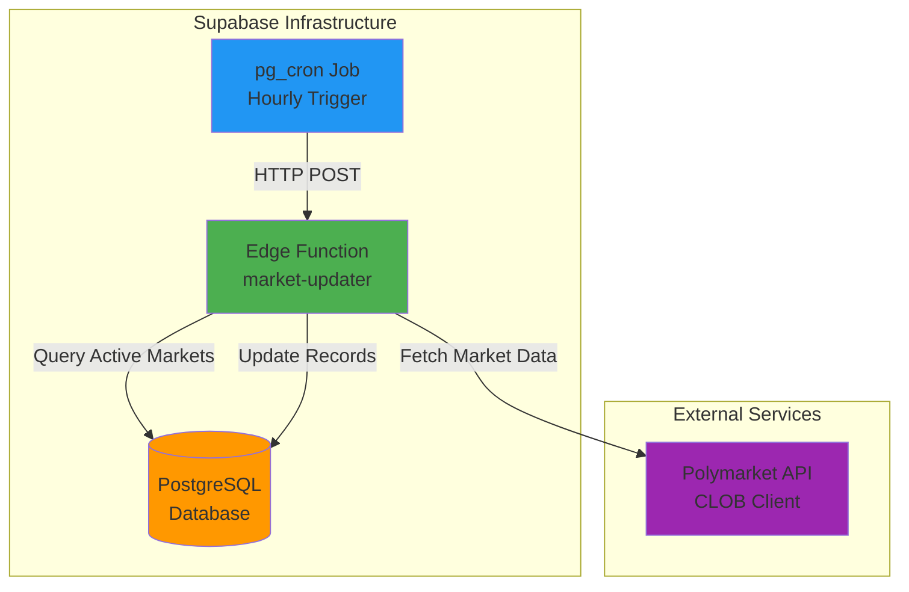
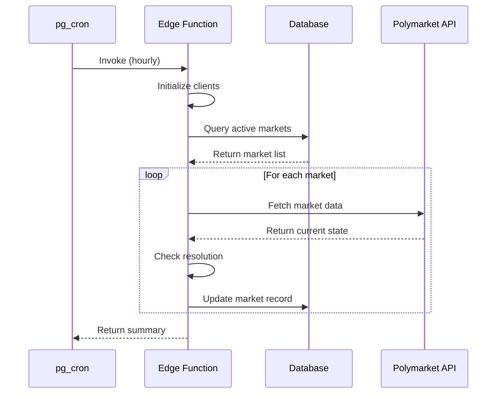

# Design Document: Supabase Market Updater

## Overview

The Supabase Market Updater is a serverless edge function that maintains fresh market data in the TradeWizard database. It runs hourly via PostgreSQL's pg_cron extension, querying active markets and updating their current state from Polymarket APIs. This lightweight solution complements the full AI-powered monitoring service by ensuring market metadata stays current without the computational overhead of running multi-agent analysis.

The function is built on Supabase Edge Functions (Deno runtime) and integrates with the existing TradeWizard database schema. It focuses on three core responsibilities:
1. Fetching current market data (prices, volumes, liquidity)
2. Detecting market resolutions
3. Updating database records efficiently

## Architecture

### System Components



### Execution Flow



### Technology Stack

- **Runtime**: Deno 2.x (Supabase Edge Functions)
- **Language**: TypeScript with strict mode
- **Database Client**: @supabase/supabase-js
- **Polymarket Client**: @polymarket/clob-client
- **Scheduler**: PostgreSQL pg_cron extension
- **Deployment**: Supabase CLI

## Components and Interfaces

### Edge Function Structure

```typescript
// supabase/functions/market-updater/index.ts

import { serve } from "https://deno.land/std@0.168.0/http/server.ts"
import { createClient } from "https://esm.sh/@supabase/supabase-js@2"
import { ClobClient } from "https://esm.sh/@polymarket/clob-client@4"

interface MarketRecord {
  id: string
  condition_id: string
  question: string
  status: string
  market_probability: number | null
  volume_24h: number | null
  liquidity: number | null
}

interface UpdateResult {
  condition_id: string
  success: boolean
  updated_fields: string[]
  error?: string
}

interface ExecutionSummary {
  total_markets: number
  updated: number
  resolved: number
  failed: number
  duration_ms: number
  errors: string[]
}
```

### Core Functions

#### 1. Main Handler

```typescript
serve(async (req: Request) => {
  const startTime = Date.now()
  const summary: ExecutionSummary = {
    total_markets: 0,
    updated: 0,
    resolved: 0,
    failed: 0,
    duration_ms: 0,
    errors: []
  }
  
  try {
    // Initialize clients
    const supabase = createSupabaseClient()
    const polymarket = createPolymarketClient()
    
    // Fetch active markets
    const markets = await fetchActiveMarkets(supabase)
    summary.total_markets = markets.length
    
    // Process each market
    for (const market of markets) {
      const result = await updateMarket(supabase, polymarket, market)
      if (result.success) {
        summary.updated++
        if (result.updated_fields.includes('status')) {
          summary.resolved++
        }
      } else {
        summary.failed++
        summary.errors.push(`${market.condition_id}: ${result.error}`)
      }
    }
    
    summary.duration_ms = Date.now() - startTime
    
    return new Response(
      JSON.stringify(summary),
      { status: 200, headers: { "Content-Type": "application/json" } }
    )
  } catch (error) {
    summary.duration_ms = Date.now() - startTime
    summary.errors.push(error.message)
    
    return new Response(
      JSON.stringify(summary),
      { status: 500, headers: { "Content-Type": "application/json" } }
    )
  }
})
```

#### 2. Client Initialization

```typescript
function createSupabaseClient() {
  const supabaseUrl = Deno.env.get('SUPABASE_URL')
  const supabaseKey = Deno.env.get('SUPABASE_SERVICE_ROLE_KEY')
  
  if (!supabaseUrl || !supabaseKey) {
    throw new Error('Missing Supabase credentials')
  }
  
  return createClient(supabaseUrl, supabaseKey)
}

function createPolymarketClient() {
  // Polymarket CLOB client for read-only operations
  return new ClobClient({
    chainId: 137, // Polygon mainnet
    // No private key needed for read-only operations
  })
}
```

#### 3. Market Fetching

```typescript
async function fetchActiveMarkets(supabase): Promise<MarketRecord[]> {
  const { data, error } = await supabase
    .from('markets')
    .select('id, condition_id, question, status, market_probability, volume_24h, liquidity')
    .eq('status', 'active')
  
  if (error) {
    throw new Error(`Failed to fetch markets: ${error.message}`)
  }
  
  return data || []
}
```

#### 4. Market Update Logic

```typescript
async function updateMarket(
  supabase,
  polymarket,
  market: MarketRecord
): Promise<UpdateResult> {
  const result: UpdateResult = {
    condition_id: market.condition_id,
    success: false,
    updated_fields: []
  }
  
  try {
    // Fetch current market data from Polymarket
    const marketData = await fetchPolymarketData(polymarket, market.condition_id)
    
    if (!marketData) {
      result.error = 'Market not found on Polymarket'
      return result
    }
    
    // Prepare update payload
    const updates: Partial<MarketRecord> = {}
    
    // Update probability
    if (marketData.probability !== market.market_probability) {
      updates.market_probability = marketData.probability
      result.updated_fields.push('market_probability')
    }
    
    // Update volume
    if (marketData.volume24h !== market.volume_24h) {
      updates.volume_24h = marketData.volume24h
      result.updated_fields.push('volume_24h')
    }
    
    // Update liquidity
    if (marketData.liquidity !== market.liquidity) {
      updates.liquidity = marketData.liquidity
      result.updated_fields.push('liquidity')
    }
    
    // Check for resolution
    if (marketData.resolved) {
      updates.status = 'resolved'
      updates.resolved_outcome = marketData.outcome
      result.updated_fields.push('status', 'resolved_outcome')
    }
    
    // Only update if there are changes
    if (Object.keys(updates).length > 0) {
      const { error } = await supabase
        .from('markets')
        .update(updates)
        .eq('id', market.id)
      
      if (error) {
        result.error = error.message
        return result
      }
    }
    
    result.success = true
    return result
    
  } catch (error) {
    result.error = error.message
    return result
  }
}
```

#### 5. Polymarket Data Fetching

```typescript
async function fetchPolymarketData(polymarket, conditionId: string) {
  try {
    // Fetch market data using CLOB client
    const market = await polymarket.getMarket(conditionId)
    
    if (!market) {
      return null
    }
    
    return {
      probability: parseFloat(market.clobTokenIds[0]?.price || '0'),
      volume24h: parseFloat(market.volume24hr || '0'),
      liquidity: parseFloat(market.liquidity || '0'),
      resolved: market.closed && market.resolvedAt !== null,
      outcome: market.outcome || null
    }
  } catch (error) {
    console.error(`Error fetching market ${conditionId}:`, error)
    throw error
  }
}
```

### Database Migration for pg_cron

```sql
-- supabase/migrations/YYYYMMDDHHMMSS_market_updater_cron.sql

-- Enable pg_cron extension
CREATE EXTENSION IF NOT EXISTS pg_cron;

-- Grant necessary permissions
GRANT USAGE ON SCHEMA cron TO postgres;
GRANT ALL PRIVILEGES ON ALL TABLES IN SCHEMA cron TO postgres;

-- Create the cron job to run hourly
SELECT cron.schedule(
  'market-updater-hourly',           -- Job name
  '0 * * * *',                       -- Cron expression (every hour at minute 0)
  $$
  SELECT
    net.http_post(
      url := 'https://[PROJECT_REF].supabase.co/functions/v1/market-updater',
      headers := jsonb_build_object(
        'Content-Type', 'application/json',
        'Authorization', 'Bearer ' || current_setting('app.settings.service_role_key')
      ),
      body := '{}'::jsonb
    ) AS request_id;
  $$
);

-- Store service role key in database settings (set during deployment)
-- ALTER DATABASE postgres SET app.settings.service_role_key = '[SERVICE_ROLE_KEY]';
```

## Data Models

### Input Models

```typescript
// Environment configuration
interface EdgeFunctionConfig {
  SUPABASE_URL: string
  SUPABASE_SERVICE_ROLE_KEY: string
  POLYMARKET_CHAIN_ID: number
}

// Database query result
interface MarketRecord {
  id: string                    // UUID
  condition_id: string          // Polymarket condition ID
  question: string              // Market question
  status: 'active' | 'inactive' | 'resolved'
  market_probability: number | null  // Current probability (0-1)
  volume_24h: number | null     // 24h volume in USD
  liquidity: number | null      // Current liquidity in USD
}
```

### Output Models

```typescript
// Polymarket API response
interface PolymarketMarketData {
  probability: number           // Current YES probability (0-1)
  volume24h: number            // 24h trading volume
  liquidity: number            // Available liquidity
  resolved: boolean            // Whether market is resolved
  outcome: string | null       // Resolution outcome if resolved
}

// Update operation result
interface UpdateResult {
  condition_id: string
  success: boolean
  updated_fields: string[]     // List of fields that changed
  error?: string               // Error message if failed
}

// Function execution summary
interface ExecutionSummary {
  total_markets: number        // Total active markets processed
  updated: number              // Successfully updated markets
  resolved: number             // Newly resolved markets
  failed: number               // Failed updates
  duration_ms: number          // Total execution time
  errors: string[]             // List of error messages
}
```

### Database Update Schema

```typescript
// Fields updated in markets table
interface MarketUpdate {
  market_probability?: number
  volume_24h?: number
  liquidity?: number
  status?: 'resolved'
  resolved_outcome?: string
  updated_at?: Date            // Automatically set by trigger
}
```

## Correctness Properties

A property is a characteristic or behavior that should hold true across all valid executions of a system—essentially, a formal statement about what the system should do. Properties serve as the bridge between human-readable specifications and machine-verifiable correctness guarantees.


### Property Reflection

After analyzing the acceptance criteria, I identified several testable properties. Here's the reflection on potential redundancy:

**Identified Properties:**
- 2.1: Query returns only active markets
- 2.2: Query includes condition_id field
- 3.1: Fetch data for all active markets
- 3.2: Fetched data contains required fields
- 3.3: Single failure doesn't stop processing
- 4.1: Successfully fetched markets get updated
- 4.2, 4.3, 4.4: Update includes probability, volume, liquidity fields
- 5.1: Check resolution status for all markets
- 5.2, 5.3: Resolved markets get status and outcome updated
- 6.6: Execution summary contains expected fields
- 1.5: Response is valid JSON with summary structure

**Redundancy Analysis:**
- Properties 4.2, 4.3, 4.4 can be combined into a single comprehensive property about update completeness
- Properties 5.2 and 5.3 can be combined into a single property about resolution updates
- Properties 1.5 and 6.6 are essentially the same - both test the response structure
- Property 2.2 is subsumed by 2.1 if we verify the complete record structure

**Final Properties (after consolidation):**
1. Active market filtering (2.1 + 2.2)
2. Fetch attempt for all markets (3.1)
3. Fetched data completeness (3.2)
4. Graceful failure handling (3.3)
5. Update completeness (4.1 + 4.2 + 4.3 + 4.4)
6. Resolution detection and update (5.1 + 5.2 + 5.3)
7. Response structure validity (1.5 + 6.6)

### Correctness Properties

Property 1: Active Market Filtering
*For any* database state with markets of various statuses, querying for active markets should return only records where status equals 'active', and each record should include the condition_id field.
**Validates: Requirements 2.1, 2.2**

Property 2: Comprehensive Market Processing
*For any* set of active markets returned from the database, the function should attempt to fetch current data from Polymarket for each market's condition_id.
**Validates: Requirements 3.1**

Property 3: Market Data Completeness
*For any* successfully fetched market from Polymarket, the returned data should contain market_probability, volume_24h, and liquidity fields with valid numeric values.
**Validates: Requirements 3.2**

Property 4: Graceful Failure Handling
*For any* set of markets where some API fetches fail, the function should continue processing remaining markets and include failed markets in the error summary without throwing an exception.
**Validates: Requirements 3.3**

Property 5: Complete Market Updates
*For any* market with successfully fetched data, the database update should include all changed fields (market_probability, volume_24h, liquidity) with values matching the fetched data.
**Validates: Requirements 4.1, 4.2, 4.3, 4.4**

Property 6: Resolution Detection and Recording
*For any* market detected as resolved on Polymarket, the database update should set status to 'resolved' and store the resolved_outcome value.
**Validates: Requirements 5.1, 5.2, 5.3**

Property 7: Execution Summary Structure
*For any* execution of the edge function (successful or failed), the response should be valid JSON containing total_markets, updated, resolved, failed, duration_ms, and errors fields.
**Validates: Requirements 1.5, 6.6**

## Error Handling

### Error Categories

1. **Configuration Errors**
   - Missing environment variables
   - Invalid Supabase credentials
   - Response: Return 500 with error message immediately

2. **Database Errors**
   - Connection failures
   - Query failures
   - Response: Return 500 with error summary

3. **API Errors**
   - Polymarket API unavailable
   - Rate limiting
   - Individual market fetch failures
   - Response: Log error, continue processing, include in summary

4. **Data Errors**
   - Invalid market data format
   - Missing required fields
   - Response: Skip update, log error, continue processing

### Error Response Format

```typescript
interface ErrorResponse {
  total_markets: number
  updated: number
  resolved: number
  failed: number
  duration_ms: number
  errors: string[]  // Detailed error messages
}
```

### Retry Strategy

For transient API failures:
- Implement exponential backoff: 1s, 2s, 4s
- Maximum 3 retry attempts per market
- Continue to next market after max retries

### Logging Strategy

All errors should be logged with:
- Timestamp
- Market condition_id (if applicable)
- Error type and message
- Stack trace for unexpected errors

## Testing Strategy

### Dual Testing Approach

The testing strategy combines unit tests for specific scenarios and property-based tests for universal correctness guarantees.

**Unit Tests** focus on:
- Specific edge cases (empty market list, missing environment variables)
- Error handling scenarios (database connection failure, API unavailable)
- Integration points (Supabase client initialization, Polymarket client setup)
- Configuration validation

**Property-Based Tests** focus on:
- Universal properties that hold for all inputs
- Comprehensive input coverage through randomization
- Data integrity across various market states

### Property-Based Testing Configuration

**Library**: fast-check (TypeScript property-based testing library)

**Configuration**:
- Minimum 100 iterations per property test
- Each test tagged with feature name and property reference
- Tag format: `Feature: supabase-market-updater, Property {number}: {property_text}`

**Property Test Implementation Pattern**:

```typescript
import fc from 'fast-check'
import { describe, it, expect } from 'vitest'

describe('Market Updater Properties', () => {
  it('Property 1: Active Market Filtering', async () => {
    // Feature: supabase-market-updater, Property 1: Active market filtering
    await fc.assert(
      fc.asyncProperty(
        fc.array(marketRecordArbitrary()),
        async (markets) => {
          // Setup: Insert markets with various statuses
          await insertMarkets(markets)
          
          // Execute: Query for active markets
          const activeMarkets = await fetchActiveMarkets(supabase)
          
          // Verify: All returned markets have status 'active'
          expect(activeMarkets.every(m => m.status === 'active')).toBe(true)
          
          // Verify: All returned markets have condition_id
          expect(activeMarkets.every(m => m.condition_id)).toBeTruthy()
          
          // Verify: No active markets were missed
          const expectedCount = markets.filter(m => m.status === 'active').length
          expect(activeMarkets.length).toBe(expectedCount)
        }
      ),
      { numRuns: 100 }
    )
  })
})
```

### Unit Test Coverage

**Configuration Tests**:
- Missing SUPABASE_URL environment variable
- Missing SUPABASE_SERVICE_ROLE_KEY environment variable
- Invalid credentials

**Edge Case Tests**:
- Empty active markets list (should return early)
- Single market update
- Market resolution detection

**Error Handling Tests**:
- Database connection failure
- Polymarket API unavailable
- Individual market fetch failure
- Malformed API response

**Integration Tests**:
- Full execution flow with mocked Polymarket API
- Concurrent updates handling
- Resolution detection and status update

### Test Data Generators

```typescript
// Arbitrary generators for property-based tests
const marketRecordArbitrary = () => fc.record({
  id: fc.uuid(),
  condition_id: fc.hexaString({ minLength: 64, maxLength: 64 }),
  question: fc.string({ minLength: 10, maxLength: 200 }),
  status: fc.constantFrom('active', 'inactive', 'resolved'),
  market_probability: fc.option(fc.double({ min: 0, max: 1 })),
  volume_24h: fc.option(fc.double({ min: 0, max: 1000000 })),
  liquidity: fc.option(fc.double({ min: 0, max: 1000000 }))
})

const polymarketDataArbitrary = () => fc.record({
  probability: fc.double({ min: 0, max: 1 }),
  volume24h: fc.double({ min: 0, max: 1000000 }),
  liquidity: fc.double({ min: 0, max: 1000000 }),
  resolved: fc.boolean(),
  outcome: fc.option(fc.constantFrom('YES', 'NO'))
})
```

### Testing Environment

**Local Development**:
- Use Supabase CLI for local database
- Mock Polymarket API responses
- Test edge function locally with `supabase functions serve`

**CI/CD Pipeline**:
- Run unit tests on every commit
- Run property-based tests with 100 iterations
- Integration tests with test database
- Deploy to staging environment for E2E validation

### Performance Testing

While not part of correctness properties, performance should be validated:
- Execution time for 10, 50, 100 markets
- Memory usage profiling
- Database connection pool efficiency
- API rate limit handling

Target: Complete execution within 60 seconds for 100 active markets.

## Deployment

### Prerequisites

1. Supabase project with PostgreSQL database
2. pg_cron extension enabled
3. Supabase CLI installed locally
4. Environment variables configured

### Deployment Steps

1. **Deploy Edge Function**
```bash
cd tradewizard-agents
supabase functions deploy market-updater
```

2. **Set Environment Variables**
```bash
supabase secrets set SUPABASE_URL=https://[PROJECT_REF].supabase.co
supabase secrets set SUPABASE_SERVICE_ROLE_KEY=[SERVICE_ROLE_KEY]
supabase secrets set POLYMARKET_CHAIN_ID=137
```

3. **Run Database Migration**
```bash
supabase db push
```

4. **Verify Cron Job**
```sql
SELECT * FROM cron.job WHERE jobname = 'market-updater-hourly';
```

5. **Test Manual Invocation**
```bash
curl -X POST \
  https://[PROJECT_REF].supabase.co/functions/v1/market-updater \
  -H "Authorization: Bearer [SERVICE_ROLE_KEY]" \
  -H "Content-Type: application/json"
```

### Monitoring

**Cron Job Logs**:
```sql
SELECT * FROM cron.job_run_details 
WHERE jobid = (SELECT jobid FROM cron.job WHERE jobname = 'market-updater-hourly')
ORDER BY start_time DESC
LIMIT 10;
```

**Function Execution Logs**:
- View in Supabase Dashboard > Edge Functions > market-updater > Logs
- Monitor execution time, success rate, error patterns

**Database Monitoring**:
```sql
-- Check recent market updates
SELECT condition_id, updated_at, status
FROM markets
WHERE updated_at > NOW() - INTERVAL '2 hours'
ORDER BY updated_at DESC;

-- Check resolution detection
SELECT condition_id, resolved_outcome, updated_at
FROM markets
WHERE status = 'resolved' AND updated_at > NOW() - INTERVAL '24 hours';
```

### Rollback Procedure

If issues arise:

1. **Disable Cron Job**
```sql
SELECT cron.unschedule('market-updater-hourly');
```

2. **Revert Edge Function**
```bash
supabase functions delete market-updater
```

3. **Restore Previous Version**
```bash
git checkout [previous-commit]
supabase functions deploy market-updater
```

4. **Re-enable Cron Job**
```sql
-- Re-run the cron migration
```

## Future Enhancements

1. **Batch Processing**: Process markets in parallel batches for improved performance
2. **Incremental Updates**: Only fetch data for markets that haven't been updated recently
3. **Webhook Integration**: Support webhook triggers for real-time updates
4. **Analytics**: Track update frequency, API success rates, resolution detection accuracy
5. **Smart Scheduling**: Adjust update frequency based on market activity and time to resolution
